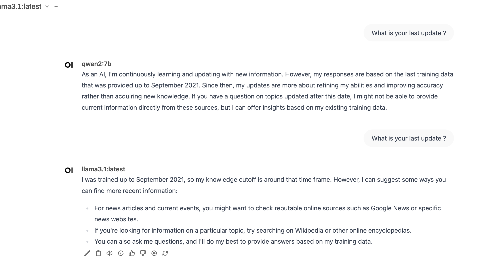

## 2024 

2023 遗留不少事

1. 吴恩达的课 看到 61课就停了  ， 2023 年11月7号
1. 如何生产自己的pip包， 2023 年 10月 18号就停了
1. 继续使用各种模型，总结
   1.  https://start.chatgot.io/ 集合几个常见
   1.  https://www.chatpdf.com/
   1.  Moonshot AI  https://moonshot.feishu.cn/docx/RnkWdeFo8oQabzxYFVwcNg1Mn9g
   1.  清华智普 、 通义千问


### 1.29

### 发布自己的包

发布 pip 包 ，之前检索到的两篇没啥用的文章。 2023 10.18 号找的几篇文章也没有什么印象了。

1. https://packaging.python.org/en/latest/guides/writing-pyproject-toml/
2. https://mathspp.com/blog/how-to-create-a-python-package-in-2022

重新 google  how to publish pip package 排名前几名文章，build 工具用最常见的 `setuptools`

1. https://builtin.com/data-science/how-to-publish-python-code-pypi 简单也比较清晰，但没有实际例子
1. https://www.turing.com/kb/how-to-create-pypi-packages `python setup.py sdist` 和 `setup.py`解释 参见 https://docs.python.org/3.10/distutils/introduction.html#distutils-simple-example 但这篇提到 `init.py`是不是必现？ 它也没提 `__init__.py`
1. 重读去年 第一篇 https://www.freecodecamp.org/news/how-to-create-and-upload-your-first-python-package-to-pypi/

另：[Difference between Module and Class in Python](https://stackoverflow.com/questions/43183244/difference-between-module-and-class-in-python)


## 1.31

### attention

Bard 推荐

1. [Visualizing A Neural Machine Translation Model (Mechanics of Seq2seq Models With Attention)](https://jalammar.github.io/visualizing-neural-machine-translation-mechanics-of-seq2seq-models-with-attention/)
2. https://jalammar.github.io/illustrated-transformer/


最新的书要读  https://udlbook.github.io/udlbook/


## 2.28

udl 看到第三章  shallow neural networks， 图 3.8 visualise a linear function of the two inputs 没彻底理解，接着看第四章

https://docs.wandb.ai/tutorials   Weights & Biases (W&B) is the AI developer platform, with tools for training models, fine-tuning models, and leveraging foundation models.

https://docs.wandb.ai/guides 试试


https://nlp.seas.harvard.edu/annotated-transformer/  要读还要试验，但是之前把transformer 再了解清楚

https://jalammar.github.io/illustrated-transformer/


## 3.12

### Requests 

https://realpython.com/python-requests/ 写代码用到又复习一下

[A Review: Pipenv vs. Poetry vs. PDM](https://dev.to/frostming/a-review-pipenv-vs-poetry-vs-pdm-39b4) 三个工具都能指定 python 版本

udl 看到第五章 Loss functions


## 3.19

### RAG

RAG & LangChain

[Advanced RAG Techniques: an Illustrated Overview](https://pub.towardsai.net/advanced-rag-techniques-an-illustrated-overview-04d193d8fec6) **在看**

[How to Improve LLMs with RAG](https://towardsdatascience.com/how-to-improve-llms-with-rag-abdc132f76ac)


### Transformer 学习材料

两篇简介

1. [Understanding Transformers and Attention](https://medium.com/@stefanbschneider/understanding-attention-and-transformers-d84b016cd352) 2023写的，标注7分钟读完。模型是简述了，但我也陆陆续续从别的地方知道了，现在是进一步深入了解，所以还要看别的

2. [Transformers: A Beginner’s Guide](https://medium.com/@nikitamalviya/transformers-a-beginners-guide-194a8ad70c4a) 作为入门介绍，这篇比上篇好

[Ketan Doshi](https://ketanhdoshi.medium.com/?source=post_page-----95a6dd460452--------------------------------) 系列

1. [Transformers Explained Visually (Part 1): Overview of Functionality](https://towardsdatascience.com/transformers-explained-visually-part-1-overview-of-functionality-95a6dd460452)

2. [Transformers Explained Visually (Part 2): How it works, step-by-step](https://towardsdatascience.com/transformers-explained-visually-part-2-how-it-works-step-by-step-b49fa4a64f34) **快看** mask 哪里没细看

3. [Transformers Explained Visually (Part 3): Multi-head Attention, deep dive](https://towardsdatascience.com/transformers-explained-visually-part-3-multi-head-attention-deep-dive-1c1ff1024853)  **Reshaping the Q, K, and V matrices** 没有理解好

4. [Transformers Explained Visually — Not Just How, but Why They Work So Well](https://towardsdatascience.com/transformers-explained-visually-not-just-how-but-why-they-work-so-well-d840bd61a9d3) 2021写的， **4.3 看完，较好理解**

[XQ](https://medium.com/@xq-is-here) 系列 有实际python 例子更容易理解

1. [Explained: Transformers for Everyone](https://medium.com/the-research-nest/explained-transformers-for-everyone-af01cbe600c5) 2024，15分钟 

2. [Explained: Tokens and Embeddings in LLMs](https://medium.com/the-research-nest/explained-tokens-and-embeddings-in-llms-69a16ba5db33) 读完，对 embedding 有一定了解

3. [Explained: Attention Mechanism in AI](https://medium.com/the-research-nest/explained-attention-mechanism-in-ai-e9bb6f0b0b4d) 代码用 notebook 试验 https://hex.tech/blog/beginners-guide-to-python-notebooks/  **4,1阅读完** 觉得有些概念没解释好，给他留言

4. [Explained: Hyperparameters in Deep Learning](https://medium.com/the-research-nest/explained-hyperparameters-in-deep-learning-9b1e0f3b9029) 4.1 读完，留言 loss function 到底怎么体现在transformer里？


**4.3 读完以上10篇** 和 https://opencv.org/blog/pytorch-vs-tensorflow/

-------

4.7 看完以下

[An Intuitive Explanation of ‘Attention Is All You Need’: The Paper That Revolutionized AI and Created Generative AI like ChatGPT](https://drlee.io/an-intuitive-explanation-of-attention-is-all-you-need-the-paper-that-revolutionized-ai-and-39aac5827411) 2023 9 分钟 看完，没什么有用的

[Understanding the Transformer Architecture in Simple English](https://medium.com/codex/understanding-the-transformer-architecture-in-simple-english-8ee30770a1e0) 2024, 8分钟 这篇比上一篇解释更清楚，作为入门了解。

[Self-Attention: A step-by-step guide to calculating the context vector](https://medium.com/@lovelyndavid/self-attention-a-step-by-step-guide-to-calculating-the-context-vector-3d4622600aac) 2023 7分钟 先看了，因为对vector 有点兴趣，但是浑沦吞枣，对理解好像没有太大帮助


[Mika.i Chak](https://medium.com/@m_chak?source=post_page-----9b46f4178b23--------------------------------) 系列8篇 还不错，短小精炼

[Transformers — In Plaintext. Part 1](https://medium.com/@m_chak/transformers-in-plaintext-part-1-4bb081135f0d) 乍一看好像还可以

[Transformers — Unknown Hero. Part 2](https://medium.com/@m_chak/transformers-unknown-hero-part-2-be2ac7afc640) 

[Transformers — In Deep Dive. Part 3](https://medium.com/@m_chak/transformers-in-deep-dive-part-3-c6fd1113f4c4)

[Transformers — does not exist without Input Processing. Part 4](https://medium.com/@m_chak/transformers-does-not-exist-without-input-processing-part-4-9b46f4178b23) 位置编码用sin/cos,解释 对于浮点数，sin/cos表示更有效

[Transformers — Is All About Attention. Part 5](https://medium.com/@m_chak/transformers-is-all-about-attention-part-5-d57cae854964) QKV 计算过程图形呈现

[Transformers — Multi-Head Attention. Part 6](https://medium.com/@m_chak/transformers-multi-head-attention-part-6-132624292959) 

[Transformers — Masked Multi-Head Attention. Part 7](https://medium.com/@m_chak/transformers-masked-multi-head-attention-part-7-5ac24517b355) 

[Transformers — Feed Forward and Output. Part 8](https://medium.com/@m_chak/transformers-feed-forward-and-output-part-8-1f959b9eca1e) 想到一个问题，整个过程怎么没看到loss function 的应用？

[The Illustrated Transformer](https://jalammar.github.io/illustrated-transformer/)  读完 ， 2018年写的，但任然是信息量最全的


------

4.8 开始

[What are Query, Key, and Value in the Transformer Architecture and Why Are They Used?](https://towardsdatascience.com/what-are-query-key-and-value-in-the-transformer-architecture-and-why-are-they-used-acbe73f731f2) 2023,10分钟  **4.8 开始读**

[The Math Behind Neural Networks](https://towardsdatascience.com/the-math-behind-neural-networks-a34a51b93873) 长

[Jay Alammar](https://jalammar.github.io/) 系列

1. [The Illustrated Transformer](https://jalammar.github.io/illustrated-transformer/)  **读完**
2. [Visualizing A Neural Machine Translation Model (Mechanics of Seq2seq Models With Attention)](https://jalammar.github.io/visualizing-neural-machine-translation-mechanics-of-seq2seq-models-with-attention/) 2018
3. https://jalammar.github.io/visualizing-neural-machine-translation-mechanics-of-seq2seq-models-with-attention/ 2018

[Roadmap to Learn AI in 2024](https://medium.com/bitgrit-data-science-publication/a-roadmap-to-learn-ai-in-2024-cc30c6aa6e16)

2.28记录的 https://nlp.seas.harvard.edu/annotated-transformer/   一定最后要试验，读完！！代码 https://github.com/harvardnlp/annotated-transformer/


[Why ChatGPT Uses Decoder-Only](https://medium.com/@row3no6/why-chatgpt-uses-decoder-only-eaf0223143e6) 

[ChatGPT's Architecture - Decoder Only? Or Encoder-Decoder?](https://datascience.stackexchange.com/questions/118260/chatgpts-architecture-decoder-only-or-encoder-decoder)


微信公众号各种文章

小插曲，被python list遍历坑了一下 [How slicing in Python works](https://stackoverflow.com/questions/509211/how-slicing-in-python-works) 比如 `::-1, ::2, for i in range(0, len(parts), 2)` 像 [Understanding string reversal via slicing](https://stackoverflow.com/questions/766141/understanding-string-reversal-via-slicing) 这里说的 You can omit one or more of the elements and it does "**the right thing**"

还有一个小教训要记牢：遍历数组元素的时候，如果一次要处理**一个以上元素**就不能用 `for in` 而是要index，而且 `for i in range `中 i 不会变，要让i变化，或者设置step(如果step固定,，比如 `for i in range(0, len(parts), 2)`)，或者就用 while 自己加 i 的step=


```
# 没有更简单的写法吗？
weighted_embeddings = {word: [weight * val for val in embedding]
                       for word, embedding in word_embeddings.items()
                       for word_weight, weight in attention_weights.items() if word == word_weight}
# 比如下面
weighted_embeddings = {word: [v * attention_weights[word] for v in word_embeddings[word]] 
                        for word in word_embeddings}
```


## 4.8 

### 位置编码实现

找到一个中文讲解  [Transformer 详解](https://wmathor.com/index.php/archives/1438/) 加代码学习, 

https://www.zhihu.com/question/347678607  位置编码

[Transformer 中的 Positional Encoding](https://wmathor.com/index.php/archives/1453/)

[Master Positional Encoding: Part I](https://towardsdatascience.com/master-positional-encoding-part-i-63c05d90a0c3)

### AI tools

[What's the difference between Cursor and the new version of Github Copilot?](https://github.com/getcursor/cursor/issues/1123)

[How to maximise the Copilot's context awareness?](https://github.com/orgs/community/discussions/51323)

尝试 https://codeium.com/ 老是报错，先放弃


## 4.16

### transformer cont.

[What are Query, Key, and Value in the Transformer Architecture and Why Are They Used?](https://towardsdatascience.com/what-are-query-key-and-value-in-the-transformer-architecture-and-why-are-they-used-acbe73f731f2) 读完，还是觉得v 矩阵多余，结果发现 [Simplified Transformer Block Architecture: Insights and Impact](https://www.e2enetworks.com/blog/simplified-transformer-block-architecture-insights-and-impact) 也说简化努力包括去掉 v 矩阵

[Transformer Architecture Simplified](https://medium.com/@tech-gumptions/transformer-architecture-simplified-3fb501d461c8) 本来以为是如何简化transformer，但其实简介

读完 [Chen Margalit](https://medium.com/@chenmargalit) 系列 没有太多新东西了

1. [Simplifying Transformers: State of the Art NLP Using Words You Understand — part 3— Attention](https://towardsdatascience.com/transformers-part-3-attention-7b95881714df) 有代码，读完！
2. [Simplifying Transformers: State of the Art NLP Using Words You Understand — part 2— Input](https://medium.com/towards-data-science/transformers-part-2-input-2a8c3a141c7d) 相关内容看过很多，快读
3. [Simplifying Transformers: State of the Art NLP Using Words You Understand — Part 4 — Feed-Forward- Layer](https://medium.com/towards-data-science/simplifying-transformers-state-of-the-art-nlp-using-words-you-understand-part-4-feed-foward-264bfee06d9)
4. [Simplifying Transformers: State of the Art NLP Using Words You Understand — Part 5 — Decoder and Final Output](https://towardsdatascience.com/simplifying-transformers-state-of-the-art-nlp-using-words-you-understand-part-5-decoder-and-cd2810c6ad40)

[What Is ChatGPT Doing … and Why Does It Work?](https://writings.stephenwolfram.com/2023/02/what-is-chatgpt-doing-and-why-does-it-work/) 看完

[The Math Behind Neural Networks](https://towardsdatascience.com/the-math-behind-neural-networks-a34a51b93873)  草草读完，主要难点还是backpropagation，在 Grokking DP 看过，之前看到Chapter 12，这会在复习一下它关于 word embedding 的描述

还是回到 udl  接着从从第五章 loss function 但马上想到NLP的loss 要怎么算，会选哪些loss function


## 4.22

### loss function in NLP

读 [Cross Entropy in Large Language Models (LLMs)](https://medium.com/ai-assimilating-intelligence/cross-entropy-in-large-language-models-llms-4f1c842b5fca)

学习 langchain https://github.com/liaokongVFX/LangChain-Chinese-Getting-Started-Guide

[LangChain Agents: Unleashing the Power of Language Models for Real-World Automation](https://medium.com/@vinusebastianthomas/langchain-agents-unleashing-the-power-of-language-models-for-real-world-automation-d4a75845717f)


## 6.4

### LangChain && RAG

[Building a Document-based Question Answering System with LangChain using LLM model](https://medium.com/@nageshmashette32/building-a-document-based-question-answering-system-with-langchain-using-llm-model-fb22e47a965c)

[AI Chatbot with your Knowledge base](https://medium.com/databutton/ai-chatbot-with-your-knowledge-base-0390c8c6e5d8)

[Building Next-Gen Apps with AI Agents](https://medium.com/databutton/building-next-gen-apps-with-ai-agents-f18551c71218)

https://www.promptingguide.ai/research/llm-agents

[Intro to LLM Agents with LangChain: Beyond Simple Prompts](https://medium.com/@siladityaghosh/intro-to-llm-agents-with-langchain-beyond-simple-prompts-4ee1edd00225) 代码跑不过，从头开始看 https://python.langchain.com/v0.2/docs/introduction/

No good (or at all) reStructuredText editor   https://www.sphinx-doc.org/en/master/usage/restructuredtext/basics.html

https://github.com/liaokongVFX/LangChain-Chinese-Getting-Started-Guide

[How to Improve LLMs with RAG](https://towardsdatascience.com/how-to-improve-llms-with-rag-abdc132f76ac)

[What is an LLM Agent and how does it work?](https://medium.com/@aydinKerem/what-is-an-llm-agent-and-how-does-it-work-1d4d9e4381ca)

跑了第一个例子  [Build a Simple LLM Application with LCEL](https://python.langchain.com/v0.2/docs/tutorials/llm_chain/) 碰到问题是如何看 LangSmith trace


## 8.14

### 实时语音助手

实时音频流 gpt 4o

RAG

网络时延

命令行里也使用红星vpn

```
export https_proxy=http://127.0.0.1:2022 http_proxy=http://127.0.0.1:2022 all_proxy=socks5://127.0.0.1:1088
```


## 8.20

[A Practical Introduction to LLMs](https://towardsdatascience.com/a-practical-introduction-to-llms-65194dda1148)  Shaw Talebi 写了5篇文档都不错。

[Cracking Open the Hugging Face Transformers Library](https://towardsdatascience.com/cracking-open-the-hugging-face-transformers-library-350aa0ef0161)

[How to Improve LLMs with RAG](https://towardsdatascience.com/how-to-improve-llms-with-rag-abdc132f76ac) 用 LlamaIndex 我之前看的是 LangChain

[LlamaIndex和LangChain](https://mp.weixin.qq.com/s/mzaCSEeDgAwxkIQKsV8EZA) [LlamaIndex对比LangChain，大模型框架孰优孰劣](https://mp.weixin.qq.com/s?__biz=MzU0NzM2NzY4NA==&mid=2247484722&idx=1&sn=470ba60d59427cf83fdad3ca06fe31ec&chksm=fb4e3b59cc39b24f0ace0081998c943e8453f5fedcc6bf327c0b7ad90981e28258223407cf5e&cur_album_id=3416949358116175876&scene=189#wechat_redirect)

[7个AI和ML工程师必知的向量数据库](https://mp.weixin.qq.com/s?__biz=MzU0NzM2NzY4NA==&mid=2247484590&idx=1&sn=9215da9d1f82846a29a6b42a58f1f935&scene=21#wechat_redirect)

https://cloud.google.com/use-cases/retrieval-augmented-generation?hl=en

https://www.datacamp.com/blog/langchain-vs-llamaindex

https://docs.llamaindex.ai/en/stable/understanding/querying/querying/


datacamp  几篇文章

1. https://www.datacamp.com/tutorial/how-transformers-work 暂时不看了
2. https://www.datacamp.com/tutorial/fine-tuning-large-language-models 太泛 但和 [Fine-Tuning Large Language Models (LLMs)](https://towardsdatascience.com/fine-tuning-large-language-models-llms-23473d763b91) 一起读了
3. [An Analysis of Voice Mode in GPT-4o](https://medium.com/@FastFedora/an-analysis-of-voice-mode-in-gpt-4o-cc0ab4c8a2c0)


## 8.23

本地部署 LLM+RAG 方案选择

1. 使用 MaxKB https://maxkb.cn/  https://github.com/1Panel-dev/MaxKB  只有linux 版本， 开箱支持RAG， 本地部署ollma,  MaxKB 使用参见 https://mp.weixin.qq.com/s/AgBrZ1pIPBjrVgdfY_7jpQ


Ollama 的使用，以及 ollama + llamaindex

1. https://mp.weixin.qq.com/s/V3h7AOqycVLVErF0JqwO4w ollama 使用
2. https://mp.weixin.qq.com/s/tknUuxkg-Y0s5DZQx54xOg ollama 使用 + **Open-webui**
3. https://mp.weixin.qq.com/s/KgKUsEyQnnncQlLQubZcUA 中文模型
4. https://docs.llamaindex.ai/en/stable/examples/llm/ollama/ 
5. https://medium.com/rahasak/build-rag-application-using-a-llm-running-on-local-computer-with-ollama-and-llamaindex-97703153db20  读 --- 完
6. https://github.com/open-webui/open-webui  dify 又一个解决方案 基于 ollama + RAG 解决方案  https://docs.dify.ai/v/zh-hans
7. 再试试 https://ollama.com/library/gemma2:2b


## 8.26

### open-webui 学习

重点试验它的RAG

我pip安装，所以路劲是 `/Users/langqiu/anaconda3/lib/python3.11/site-packages/data/docs`

通过全盘搜索 `sqlite:///${DATA_DIR}/webui.db` 找到

如果是容器启动就在  `./app/backend/data/docs`

[Let's build a customer support chatbot using RAG and your company's documentation in OpenWebUI](https://hostkey.com/blog/72-lets-build-a-customer-support-chatbot-using-rag-and-your-companys-documentation-in-openwebui/)

SentenceTransformers    https://sbert.net/ vs https://github.com/google/sentencepiece

了解 open-webui 里pipeline的概念

[Using Ollama: Getting hands-on with local LLMs and building a chatbot](https://medium.com/@arjunrao87/using-ollama-getting-hands-on-with-local-llms-and-building-a-chatbot-aabba1926b07) 提到另个库 [chainlit](https://docs.chainlit.io/get-started/overview)


```
RAG_EMBEDDING_MODEL
Type: str
Default: sentence-transformers/all-MiniLM-L6
Description: Sets a model for embeddings. Locally, a Sentence-Transformer model is used.
```


[Building LLM Applications: Introduction (Part 1)](https://medium.com/@vipra_singh/building-llm-applications-introduction-part-1-1c90294b155b#4d28) 会员文章  https://mp.weixin.qq.com/s/8f2999CULQ0YS-_9YUtD2A  做了相应翻译


reranker  Cross Encoder 熟悉  “Calculates a **similarity score** given **pairs of texts**.”

https://sbert.net/docs/sentence_transformer/usage/usage.html

Characteristics of Sentence Transformer (a.k.a bi-encoder) models:

1. Calculates a **fixed-size vector representation (embedding)** given **texts or images**.
2. Embedding calculation is often **efficient**, embedding similarity calculation is **very fast**.
3. Applicable for a **wide range of tasks**, such as semantic textual similarity, semantic search, clustering, classification, paraphrase mining, and more.
4. Often used as a **first step in a two-step retrieval process**, where a Cross-Encoder (a.k.a. reranker) model is used to re-rank the top-k results from the bi-encoder.

差别到底在哪？

- `SimilarityFunction.COSINE` (a.k.a “cosine”): Cosine Similarity (**default**)
- `SimilarityFunction.DOT_PRODUCT` (a.k.a “dot”): Dot Product

https://sbert.net/examples/applications/retrieve_rerank/README.html 有机会再看

Model filesystem path detected. Model shortname is required for update, cannot continue.

https://github.com/FlagOpen/FlagEmbedding/issues/1086


[Compare Llama-3 & Qwen using RAG](https://medium.com/@koratarpans99/compare-llama-3-qwen-using-rag-76ae35e6985c) 比较，RAG 用 LlamaIndex 提到的 https://streamlit.io/  有机会试试

https://docs.llamaindex.ai/en/stable/understanding/using_llms/using_llms/ 要看

https://python.langchain.com/v0.2/docs/tutorials/llm_chain/  langchain暂时不看，但是 open webui 用它是个潜在问题


## 8.27

RAG效果不佳的总结


目前试用 RAG的效果不佳，没有从我们提供文档里给出我想要答案。我想原因大致有几个：

1. 我自己体会是如果我给RAG的私有文档数量不多，就几篇文章，最多不超过一二十篇，RAG是没有效果的，还不如强化提示词内容，提供更多上下文给prompt。这个大家可以再研究一下。 上周听完阿里介绍的百炼（阿里的RAG）我本来先试试它效果，看看它对少量私有文档有什么优化，但没用起来，百炼报错 'code': 'AccessDenied.Unpurchased' 我在页面上也没看到购买的地方。钉钉催他们几次没有回复。
2. 我觉得效果不佳的另一个原因是文本嵌入的效果不佳，但我已经把对中文支持好的文本嵌入模型都试了，包括智源的，所以这块可能没有什么进一步可做。
3. RAG 具体实现两个技术路线 langchain 和 llamaIndex ，我之前自学觉得langchain还是太复杂，没琢磨出所以然来。llamaindex我反而觉得容易上手一点。但是我现在找到这个开源工具，包括本地部署大模型，以及提供web界面。它还是用 langchain 所以如果基于它来开发就还是要把 langchain搞清楚一点，或者看看它能否支持 llamaIndex
4. 如果我们确实准备自研 RAG，包括自己私有化部署， RAG这个技术路线还是搞清楚一点，有没有别的人也来研究一下。
5. 市面上现有产品，重点是好称对中文支持好的，我们可以再试试。现在阿里的暂时试验不起来，可以再看看智源是否用起来。
6. 关于实时语音助手，如果要自己私有化部署，只能是用阿里开源的 qwen-audio ，好像没有第二个选择。这块看看下，我重点看RAG，以及 私有化部署

[How I’ve Optimized Document Interactions with Open WebUI and RAG: A Comprehensive Guide](https://medium.com/@kelvincampelo/how-ive-optimized-document-interactions-with-open-webui-and-rag-a-comprehensive-guide-65d1221729eb)


https://www.reddit.com/r/LocalLLaMA/comments/1cm6u9f/local_web_ui_with_actually_decent_rag/


Is there any local web UI with actually decent RAG features and knowledge base handling? I think I have looked everywhere (listing just the popular one):

- Open WebUI - handles poorly bigger collections of documents, lack of citations prevents users from recognizing if it works on knowledge or hallucinates. It also bugs out on downloading bigger models.
- AnythingLLM - document handling at volume is very inflexible, model switching is hidden in settings. Tends to break often as well.
- RAGFlow - inmature and in terrible state deployment-wise. Docker-compose.yml is using some strange syntax that doesn't work on on what I have tried to use. It also bundles a lot of unnecessary infrastructure components like proxy server and S3 storage which makes it hell to deploy on Kubernetes.
- Danswer - very nice citation features, but breaks on upgrades and knowledge base management is admin level action for all users - very inflexible setup.

One would think that in hundreds of LLM / RAG open source projects there would be one packed into container, with basic set of chat + easy model switch + knowledge base management per user + citations features developed together. But I'm failing to find one.

给 open webui 提了两个问题 ，基本放弃了

1. https://github.com/open-webui/open-webui/discussions/5002
2. https://github.com/open-webui/open-webui/discussions/5022

https://www.reddit.com/r/LocalLLaMA/comments/1bp5ip0/love_the_ollama_open_webui_combo_but_can_someone/


[Building a Better RAG: A Practical Guide to Two-Step Retrieval with LangChain](https://medium.com/@alihaydargulec/building-a-better-rag-a-practical-guide-to-two-step-retrieval-with-langchain-e9ffe6e8aa8b)

#### Vector Embedding 三种选择

Once you have the processed text (summaries or keywords), you’ll need to convert them into vector representations using a suitable embedding model. Popular choices include:

- **Sentence Transformers**: Pre-trained models like `all-MiniLM-L6-v2` or `multi-qa-MiniLM-L6-cos-v1` can generate high-quality sentence embeddings.
- **Hugging Face Transformers**: You can leverage pre-trained language models like `bert-base-uncased` or `distilbert-base-uncased` to generate embeddings.
- **OpenAI Embeddings**: OpenAI’s `text-embedding-ada-002` model is another option for generating embeddings.

### Reranking

https://sbert.net/examples/applications/retrieve_rerank/README.html 最基本解释

https://www.rungalileo.io/blog/mastering-rag-how-to-select-a-reranking-model

https://www.pinecone.io/learn/series/rag/rerankers/

中文解释 https://www.53ai.com/news/qianyanjishu/2072.html 和试验例子 https://www.53ai.com/news/qianyanjishu/2024061756749.html 它还提到 anything llm https://www.53ai.com/news/RAG/2024083181692.html

要放弃 open webui的 rag 了 

[一文详解几种常见本地大模型个人知识库工具部署、微调及对比选型](https://developer.aliyun.com/article/1533026?spm=a2c6h.14164896.0.0.62ad47c5qpDCFu&scm=20140722.S_community@@%E6%96%87%E7%AB%A0@@1533026._.ID_1533026-RL_openwebuirag-LOC_search~UND~community~UND~item-OR_ser-V_3-P0_11)


买了一个月阿里云机器 70块 root/ Qiulang76@bj 忘记阿里云登录密码，账号是 qiulang2000@hotmail.com 改用支付宝账号登录。

```
[1Panel Log]: =================感谢您的耐心等待，安装已经完成==================
[1Panel Log]:
[1Panel Log]: 请用浏览器访问面板:
[1Panel Log]: 外网地址: http://39.105.220.18:33780/c2e9c718f0
[1Panel Log]: 内网地址: http://172.28.241.144:33780/c2e9c718f0
[1Panel Log]: 面板用户: 83db69034f
[1Panel Log]: 面板密码: qiulang@bj
[1Panel Log]:
[1Panel Log]: 项目官网: https://1panel.cn
[1Panel Log]: 项目文档: https://1panel.cn/docs
[1Panel Log]: 代码仓库: https://github.com/1Panel-dev/1Panel
[1Panel Log]:
[1Panel Log]: 如果使用的是云服务器，请至安全组开放 33780 端口
[1Panel Log]:
[1Panel Log]: 为了您的服务器安全，在您离开此界面后您将无法再看到您的密码，请务必牢记您的密码。
[1Panel Log]:
[1Panel Log]: ================================================================
```

阿里云 安全组， **入方向** 设置 自定义 TCP 33780 端口


`[1Panel Log]`: 外网地址: http://39.105.220.18:33780/c2e9c718f0
`[1Panel Log]`: 面板用户: 83db69034f
`[1Panel Log]`: 面板密码: qiulang@bj

http://39.105.220.18:8080/ui/login   MaxKB admin/Qiulang76@bj  qiulang/qiulang2000@bj
用户使用 http://39.105.220.18:8080/ui/chat/cd83b12139e56bc0


```
% ssh root@39.105.220.18
root@39.105.220.18's password: Qiulang76@bj
Welcome to Ubuntu 22.04.4 LTS (GNU/Linux 5.15.0-113-generic x86_64)

 * Documentation:  https://help.ubuntu.com
 * Management:     https://landscape.canonical.com
 * Support:        https://ubuntu.com/pro

 System information as of Tue Sep 24 04:40:43 PM CST 2024

  System load:  0.12               Processes:             185
  Usage of /:   21.7% of 98.05GB   Users logged in:       0
  Memory usage: 28%                IPv4 address for eth0: 172.28.241.144
  Swap usage:   0%

  => There are 8 zombie processes.
  
  root@iZ2ze48d2g1u1au256k9syZ:~# docker ps
CONTAINER ID   IMAGE                                COMMAND                  CREATED       STATUS                 PORTS                                                 NAMES
ed248d5b132e   ghcr.io/open-webui/open-webui:main   "bash start.sh"          3 weeks ago   Up 3 weeks (healthy)   0.0.0.0:3000->8080/tcp, [::]:3000->8080/tcp           1Panel-ollama-webui-njlt
9eb43c0c40a7   ollama/ollama:0.3.9                  "/bin/ollama serve"      3 weeks ago   Up 3 weeks             0.0.0.0:11434->11434/tcp, :::11434->11434/tcp         1Panel-ollama-gGXW
410ec330fbaa   1panel/maxkb:v1.5.1                  "bash -c /usr/bin/ru…"   3 weeks ago   Up 3 weeks             5432/tcp, 0.0.0.0:8080->8080/tcp, :::8080->8080/tcp   1Panel-maxkb-lYFb

root@iZ2ze48d2g1u1au256k9syZ:~# docker exec -it 410ec330fbaa bash

root@410ec330fbaa:/opt/maxkb/app# curl http://172.28.241.144:11434
Ollama is running
root@410ec330fbaa:/opt/maxkb/app#
```


https://github.com/svjack/Sbert-ChineseExample  **Sentence-Transformers 中文信息检索例子** 目前估计用不上，因为对 Sentence-Transformers 理解还比较肤浅。


## 9.4

### 自己动手RAG

[Build RAG Application Using a LLM Running on Local Computer with Ollama and Langchai](https://medium.com/rahasak/build-rag-application-using-a-llm-running-on-local-computer-with-ollama-and-langchain-e6513853fda0) 看完没感觉 再看 https://python.langchain.com/v0.2/docs/tutorials/llm_chain/

langchain 两个 rag 的 tutorial 做完了

https://python.langchain.com/v0.2/docs/tutorials/rag/   https://python.langchain.com/v0.2/docs/tutorials/local_rag/  

再看怎么往下走

[Build RAG Application Using a LLM Running on Local Computer with Ollama Llama2 and LlamaIndex](https://medium.com/rahasak/build-rag-application-using-a-llm-running-on-local-computer-with-ollama-and-llamaindex-97703153db20)

跑  https://docs.llamaindex.ai/en/stable/getting_started/starter_example_local/ 跑ollama例子，红星vpn 不能开成全局模式。

`pip install llama-index-vector-stores-chroma`  但是  RAG CLI 没跑起来 https://docs.llamaindex.ai/en/stable/getting_started/starter_tools/rag_cli/  报错 


langchain 可以再试试 https://python.langchain.com/v0.2/docs/how_to/qa_chat_history_how_to/ 

目前是为了看懂 open webui怎么做的，查怎么进  `@app.post("/query/doc")`

```
query_doc_handler 这个文件只有在 # 文件 或者 ENABLE_RAG_HYBRID_SEARCH 才会进，
而且 ENABLE_RAG_HYBRID_SEARCH 的结果还不准确， 不如 #
```

前端项目 `queryDoc` 


## 9.13

### llamaindex

[Understanding LlamaIndex: Features and Use Cases](https://bhavikjikadara.medium.com/understanding-llamaindex-features-and-use-cases-c433c3246e86) 


## 9.18

[The RAG don't work ! ](https://github.com/open-webui/open-webui/discussions/5460) 我发现新的修改对我也不适用！

测试正式发布的 0.3.21 不稳定，有时候会找不到ollama 接口，没有发现已有模型，设置文档数据也被清空。

几个备选：


1. https://github.com/infiniflow/ragflow 17k ，试验结果一般
2. https://github.com/1Panel-dev/MaxKB 中文试用效果好，但是怎么用ollama
3. https://github.com/SciPhi-AI/R2R 一个人的项目 3.3K


## 9.19

### 实际比较RAG结果

embedding 模型带来结果差异的

1. What happened to Peter Hessler in 2022 and after?


### Elasticsearch

Elasticsearch + RAG ,why ?


### open-webui 0.3.23 9-21

```
conda-repo-cli 1.0.75 requires requests_mock, which is not installed.
spyder 5.4.3 requires pyqt5<5.16, which is not installed.
spyder 5.4.3 requires pyqtwebengine<5.16, which is not installed.
conda-repo-cli 1.0.75 requires clyent==1.2.1, but you have clyent 1.2.2 which is incompatible.
conda-repo-cli 1.0.75 requires python-dateutil==2.8.2, but you have python-dateutil 2.9.0.post0 which is incompatible.
conda-repo-cli 1.0.75 requires PyYAML==6.0.1, but you have pyyaml 6.0.2 which is incompatible.
conda-repo-cli 1.0.75 requires requests==2.31.0, but you have requests 2.32.3 which is incompatible.
```

升级报错，开问题单 https://github.com/open-webui/open-webui/issues/5620  但是 `conda update conda`后可以了。但是每次升级，embedding model 都被改回 `sentence-transformers/all-MiniLM-L6-v2` 

先确认 llama 3.1 8b 和 qwen2 7b 最后的训练时间, [Unlock LLaMA 3.1: A Beginner’s Guide to Getting Started Anywhere](https://medium.com/@lmpo/getting-started-with-llama-3-1-2830320cf10b) 说 “LLaMA 3.1 405B’s training data cutoff is December 31, 2022, the model’s responses indicate knowledge of events up to around April 2023.”

我问了同一个问题  "tell me the version number of latest python ?" , llama 3.1 8b 回答 “My knowledge cutoff is December 2021 ...” , qwen2 7b 回答 “As of my last update in October 2023...”

但我问 Do you know corejs author zloirock wrote an article called "So, what's next?" 和 “It is an article talking about his personal struggle with corejs project” 他们都瞎答，所以就适合用这篇长文来测试。这篇其实是 [2023-02-14-so-whats-next.md](https://github.com/zloirock/core-js/blob/master/docs/2023-02-14-so-whats-next.md) 不过千问2没有

先让 kimi, claude 和 openai 试试总结


https://blog.openreplay.com/svelte-vs-bue--a-comparison/


## 9.24

询问模型的最后训练数据和最后的更新是两个不同问题，会有不同答复，而且重复问，答案也有不同

What is your last update ? 和 What is your last training data ?

what is the latest version of typescript ? 和 what is the latest version of python ?




## 9.25

自从发现 maxkb 用的 word embedding **maxkb-embedding** 其实是 https://github.com/shibing624/text2vec 然后再看它的文档，我之前疑问就又提出，为什么现在开源的 word embedding 都是基于 [sentence-transformers](https://github.com/UKPLab/sentence-transformers) (https://github.com/UKPLab/sentence-transformers) ？ 连这个 text2ve也提供基于 st的形式？

但它说的它的模型是 CoSENT（Cosine Sentence）文本匹配模型，在Sentence-BERT上改进了CosineRankLoss的句向量方案

SO 上 4个词嵌入问题：

[How to calculate the sentence similarity using word2vec model of gensim with python](https://stackoverflow.com/questions/22129943/how-to-calculate-the-sentence-similarity-using-word2vec-model-of-gensim-with-pyt) 这个问答提到 st

[BERT sentence embeddings from transformers](https://stackoverflow.com/questions/63461262/bert-sentence-embeddings-from-transformers) 和我问的问题相关 [What does SentenceTransformers provide to simplify sentence embedding?](https://stackoverflow.com/questions/79022351/what-does-sentencetransformers-provide-to-simplify-sentence-embedding) 

[Sentence similarity models not capturing opposite sentences](https://stackoverflow.com/questions/69374258/sentence-similarity-models-not-capturing-opposite-sentences) 提到 句子词嵌入的几种方法在 [Algorithms for Sentence Embedding: Transforming Words into Vectors](https://medium.com/@ilyurek/algorithms-for-sentence-embedding-transforming-words-into-vectors-b02d7fa7782)  也提到几种 Sentence Embedding  方法，包括 sbert

还有 [What is purpose of the **CLS** token and why is its encoding output important?](https://datascience.stackexchange.com/questions/66207/what-is-purpose-of-the-cls-token-and-why-is-its-encoding-output-important) 


[文本向量表示方法](https://github.com/shibing624/text2vec/wiki/%E6%96%87%E6%9C%AC%E5%90%91%E9%87%8F%E8%A1%A8%E7%A4%BA%E6%96%B9%E6%B3%95) 是 https://github.com/shibing624/text2vec 写的， 我的问题和作者回答 https://github.com/shibing624/text2vec/issues/154 

https://huggingface.co/embedding-data/deberta-sentence-transformer 不用 sf 的例子和 https://github.com/shibing624/text2vec  和 一样，都用到 mean_pooling

#### 文本向量表示模型 估计理解 句子迁入一个重点


[Best Open Source Sentence Embedding Models in August 2024](https://codesphere.com/articles/best-open-source-sentence-embedding-models)

看一个例子 https://huggingface.co/sentence-transformers/multi-qa-MiniLM-L6-cos-v1 还有 https://huggingface.co/tasks/sentence-similarity  看完，我之前写的例子估计从这里得到灵感 , 当然还有这里 https://sbert.net/examples/applications/semantic-search/README.html 和 [Building Simple Semantic Search using Sentence Transformers](https://medium.com/@bhavyagiri/building-simple-semantic-search-using-sentence-transformers-48ba17bf9b01)

和我的例子类似的还有这个 [Semantic Search with Few Lines of Code](https://medium.com/nlplanet/semantic-search-with-few-lines-of-code-490df1d53fd6)

还有 https://github.com/UKPLab/sentence-transformers/issues/64 关于USE 的讨论 和 [Universal Sentence Encoder Visually Explained](https://amitness.com/posts/universal-sentence-encoder#why-learned-sentence-embeddings) 这篇虽然是讲 USE 但是讲到一些句子迁入的训练方法。

https://huggingface.co/blog/getting-started-with-embeddings 长，找时间看

https://arxiv.org/html/2406.01607v1  https://www.linkedin.com/pulse/guidebook-state-of-the-art-embeddings-information-aapo-tanskanen-pc3mf/

https://www.architecture-performance.fr/ap_blog/using-a-local-sentence-embedding-model-for-similarity-calculation/

https://discuss.huggingface.co/t/difference-bertmodel-automodel-and-automodelformaskedlm/24340 显示

```
from transformers import BertModel
model = BertModel.from_pretrained("bert-base-uncased")

from transformers import AutoModel
model = AutoModel.from_pretrained("bert-base-uncased")
一样的
The AutoModel will look at the bert-base-uncased model’s configuration and choose the appropriate base model architecture to use, which in this case is BertModel. So Code 1 and Code 2 will essentially do the same thing, and when you run an inference on either of those models you’ll get the same output, which is the last hidden states from the bert-base-uncased model body.
```


## 9.26

[Two minutes NLP — 11 word embeddings models you should know](https://medium.com/nlplanet/two-minutes-nlp-11-word-embeddings-models-you-should-know-a0581763b9a9)

[Two minutes NLP — Sentence Transformers cheat sheet](https://medium.com/nlplanet/two-minutes-nlp-sentence-transformers-cheat-sheet-2e9865083e7a) 介绍了 Paraphrase Mining 就是从一堆语料中找到相似文本

[N-grams in NLP](https://medium.com/@abhishekjainindore24/n-grams-in-nlp-a7c05c1aff12) 较早的技术

[Two minutes NLP — Doc2Vec in a nutshell](https://medium.com/nlplanet/two-minutes-nlp-doc2vec-in-a-nutshell-25be546a8342)

https://en.wikipedia.org/wiki/Sentence_embedding

https://huggingface.co/IDEA-CCNL/Erlangshen-TCBert-1.3B-Sentence-Embedding-Chinese 二郎神这个模型不基于 sentence embedding

[What is Named Entity Recognition (NER)? Methods, Use Cases, and Challenges](https://www.datacamp.com/blog/what-is-named-entity-recognition-ner) 符合用chatgpt 润色的特点 “The colorful **tapestry** of human language,”

[Named Entity Recognition (NER) in Python with Spacy](https://www.analyticsvidhya.com/blog/2021/06/nlp-application-named-entity-recognition-ner-in-python-with-spacy/)

https://sparknlp.org/

[Understanding the Difference Between Stemming and Lemmatization](https://medium.com/@tejaswaroop2310/understanding-the-difference-between-stemming-and-lemmatization-dbfdfed98df0#:~:text=Speed%3A%20Stemming%20is%20generally%20faster,yields%20actual%20words%20(lemmas).) 词形还原和词干提取


总结对 句子嵌入的理解：

1. sbert 一统天下，但还有别的选择吗？有 [Top 4 Sentence Embedding Techniques using Python](https://www.analyticsvidhya.com/blog/2020/08/top-4-sentence-embedding-techniques-using-python/) 做了不错的解释 和 sbert自己的  [Performance Comparison](https://www.sbert.net/docs/pretrained-models/nli-models.html#performance-comparison) 
2. 我关心的中文有什么选择，智源和 https://github.com/shibing624/text2vec/
3. sbert 为什么能一统天下，它到底做了什么，它和实际运用的 pre-trained BERT model 模型是什么关系 https://github.com/UKPLab/sentence-transformers/issues/2958
4. 中文这两个模型不是 sentence bert 模型为什么也能用  sbert加载
5. 文章阅读 https://osanseviero.github.io/hackerllama/blog/posts/sentence_embeddings/ 
6. 对于英文句子，其他选择  比如 **USE** sbert 认为性能不如它 https://github.com/UKPLab/sentence-transformers/issues/64 而facebook的InferSent 也消声了，而且 InferSent 如果只是训练了英文语料 [SNLI (Stanford Natural Language Inference) dataset](https://nlp.stanford.edu/projects/snli/). 

[最佳Embedding模型效果对比 - OpenAI / Cohere / Google / E5 / BGE](https://53ai.com/news/qianyanjishu/2437.html) 最近经常读到 **53ai** 的文章，这篇主要是让我知道 Cohere和 **E5 embedding**


## 9.27 

### 发现一个新的系列

https://osanseviero.github.io/hackerllama/blog/posts/sentence_embeddings/ 很长，终于看完 留言，希望有答复，类似 [我的sbert问题](https://github.com/UKPLab/sentence-transformers/issues/2958)


## 9.30

### cohere

才知道 cohere 提供文本嵌入的商用产品，它的文档可以看看


阿里云部署 MaxKB  马上到期，几个收获：

1. 文本嵌入它用 https://github.com/shibing624/text2vec
2. 对接ollama ，只有部署ollama 然后保证在maxkb的容器能访问 ollama接口就行。比如我的部署就写 http://172.28.241.144:11434 这是部署的阿里云机器的内网ip 


每次升级 open webui 文本嵌入都被重置成 sentence-transformers/all-MiniLM-L6-v2  都要手动改回 


## 10.6

### Cohere 文档

https://cohere.com/llmu

https://cohere.com/llmu/sentence-word-embeddings  看完

https://cohere.com/llmu/constructing-prompts 找ollama试试

```
ollama list 
ollama rm
files in  ~/.ollama/models/blobs
//https://github.com/ollama/ollama/issues/4122
```


## 10.8-10.9

https://osanseviero.github.io/hackerllama/blog/posts/sentence_embeddings2/ 读完 Reranker

https://docs.cohere.com/page/basic-rag 代码示例实现 embedding, rerank, search, generate answer

https://www.ibm.com/topics/zero-shot-learning 解释得不好。

骚扰一下 Fengshenbang-LM https://github.com/IDEA-CCNL/Fengshenbang-LM/issues/468

要不要再读读 https://osanseviero.github.io/hackerllama/blog/posts/random_transformer/ ？

[why we no longer use LangChain for building our AI agents](https://www.octomind.dev/blog/why-we-no-longer-use-langchain-for-building-our-ai-agents)

https://www.anthropic.com/news/contextual-retrieval  提到用BM25在语义检索基础上增加关键词检索。open-webui的hybrid-search已经用了，但是我改成 BAAI/bge-reranker-v2-m3 了 https://huggingface.co/BAAI/bge-m3 说更好

这篇文章重点就是几种技术一起用 hybrid-retrieval + context retrieval + reranker 

再参见 [How to Use Hybrid Search for Better LLM RAG Retrieval](https://towardsdatascience.com/how-to-use-hybrid-search-for-better-llm-rag-retrieval-032f66810ebe)  Semantic Search or Keyword Search? 没细读，因为概念都知道了

[BM25算法以及变种算法简介](https://www.53ai.com/news/qianyanjishu/2024060763179.html)

https://www.pinecone.io/learn/retrieval-augmented-generation/ 没有新意

https://www.pinecone.io/blog/why-use-retrieval-instead-of-larger-context/ 没看出要说什么

又一个 https://docs.nomic.ai/reference/api/embed-text-v-1-embedding-text-post ， `OllamaEmbeddings(model="nomic-embed-text")` 骚扰一下 https://github.com/nomic-ai/cookbook/issues/17


https://www.gradio.app/guides/quickstart 以后再看


## 10.11

### Python thread.daemon = True 

这两个 SO的问答其实都没说清楚

[Daemon Threads Explanation](https://stackoverflow.com/questions/190010/daemon-threads-explanation)

[Meaning of daemon property on Python Threads](https://stackoverflow.com/questions/4330111/meaning-of-daemon-property-on-python-threads) 

官网示例 https://docs.python.org/3/library/socketserver.html

```
  # Start a thread with the server -- that thread will then start one
  # more thread for each request
  server_thread = threading.Thread(target=server.serve_forever)
  # Exit the server thread when the main thread terminates
  server_thread.daemon = True
  server_thread.start()
  print("Server loop running in thread:", server_thread.name)
```


还是和Claude的对话得到答复  daemon=True is a bit counter-intuitive because deamon normally mean it will not automatically close when the main program exits. Isn't it ?

```
Daemon threads in Python:
In Python threading, setting daemon=True actually means that the thread will automatically terminate when the main program exits. This is indeed counterintuitive given the general understanding of the term "daemon" in computing.
Traditional daemon processes:
In traditional computing and Unix systems, a daemon process is indeed a background process that continues running even after the parent process exits. This is likely the definition you're familiar with, and it's correct in that context.
```


### sentence embedding

google sentence embedding 排名分别是

1. https://cohere.com/llmu/sentence-word-embeddings 入门好，但更多是解释了基本概念 word embedding ， 没有介绍如何从 word embedding 到 sentence embedding，如何得到 sentence embedding , 最后介绍 cohere 自己的 Multilingual Sentence Embeddings， 但是我不看好它对中文的处理
2. https://en.wikipedia.org/wiki/Sentence_embedding 没有太多有用信息
3. [Sentence Embedding Methods— A Survey](https://medium.com/@busra.oguzoglu/sentence-embedding-methods-a-survey-7c62857f7b43) 2021文章，大致扫了几眼，没有 sbert，介绍了 **InferSent** 和 **Universal Sentence Encoder**
4. https://osanseviero.github.io/hackerllama/blog/posts/sentence_embeddings/ 2024 读了，最全
5. sbert
6. https://www.reddit.com/ 论坛推荐 第四篇！
7. [What are Sentence Embeddings and Their Applications?](https://www.taus.net/resources/blog/what-are-sentence-embeddings-and-their-applications) 2021 短，扫了
8. https://johnbrandt.org/blog/sentence-similarity/ 应该也是较早，没有谈sbert，但谈了早期一些方法是如何演进
9. [Sentence Embedding by BERT and Sentence Similarity](https://peaceful0907.medium.com/sentence-embedding-by-bert-and-sentence-similarity-759f7beccbf1) 大致看了，没什么特别
