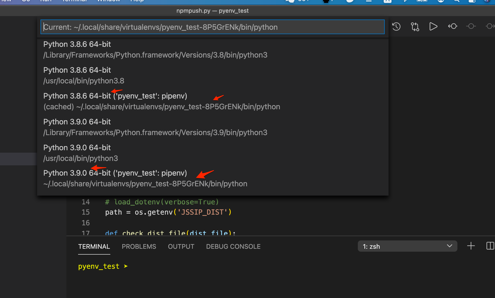

### 4.9

#### 一年整

学习已经一年，当然实际时间不到6个月，而且还是花在平时晚上或者周末一点零碎时间。今天没有学习新东西就是记录下。

### 4.26

#### 长字符串

一年又20天后，第一次写python

[UnboundLocalError: local variable 'x' referenced before assignment](https://stackoverflow.com/questions/9264763/dont-understand-why-unboundlocalerror-occurs-closure) 

> Python doesn't have variable declarations, so it has to figure out the [scope](http://docs.python.org/3.3/tutorial/classes.html#python-scopes-and-namespaces) of variables itself. It does so by a simple rule: If there is an assignment to a variable inside a function, that variable is considered local.[[1\]](http://docs.python.org/3.3/faq/programming.html#what-are-the-rules-for-local-and-global-variables-in-python)

> In Python, variables that are only referenced inside a function are implicitly global. 

一行长串， 各种方法 https://stackoverflow.com/questions/10660435/pythonic-way-to-create-a-long-multi-line-string，下面这样最简单

```python
 s = ("this is a very"
      "long string too"
      "for sure ..."
     )
 # 但下面这样可避免 query == "SELECT fooFROM barWHERE baz" 
 query = ' '.join((  # note double parens, join() takes an iterable
    "SELECT foo",
    "FROM bar",
    "WHERE baz",
  ))

```

对比 js

```javascript
var multiStr = "This is the first line" + 
	"This is the second line" + 
	"This is more...";
	
var multiStr = "This is the first line \
	This is the second line \
	This is more...";
```


### 4.30

#### md tight list & loose list

解决使用 typora 一个长久的困惑，顺便给它开了一个 [bug](https://github.com/typora/typora-issues/issues/3467)： 

markdown number list 两种风格 tight & loose, 差别就是有没有多加一行(blank line) , 转成html时候是不是加 `<p>` https://github.github.com/gfm/#tight 这个在md的基本语法里没有提到 https://www.markdownguide.org/basic-syntax/ 

[Why are there even tight lists?](https://talk.commonmark.org/t/why-are-there-even-tight-lists/2301) 这里回答说是历史原因 

> It’s partly a backwards-compatibility issue, since Gruber’s original Markdown had a distinction between tight and loose lists that was realized this way (presence or absence of p tags). 

**[Jeff Atwood](https://meta.discourse.org/u/codinghorror)** 大牛也参与这类讨论 [Markdown nested lists have different vertical padding for different bullet depths](https://meta.discourse.org/t/markdown-nested-lists-have-different-vertical-padding-for-different-bullet-depths/106166)

[Extra lines appearing between list items in Github Markdown](https://stackoverflow.com/questions/43503528/extra-lines-appearing-between-list-items-in-github-markdown) 这个讨论没有详细看了


### 5.6

#### DAG

5.1假日看了下图和DAG，现在可以开始看结巴代码，以下几个连接是不是提供有用信息还不清楚：

1. [NLP之中文分词算法(DAG图)解析及实战](https://hadxu.github.io/2018/01/19/NLP之中文分词算法(DAG图)解析及实战/)

2. [jieba中文分词源码分析（三）](https://blog.csdn.net/daniel_ustc/article/details/48223135)

3. [jieba分词源码解读一](https://blog.csdn.net/shenxiaoming77/article/details/51511289)

4. [jieba分词流程及部分源码解读（一）](https://blog.csdn.net/Jameslvt/article/details/81118560)


### 5.11

#### 读结巴代码

```python
while i<N and frag in self.FREQ: # FREQ 对词的前缀都存，但是前缀值是0
		if self.FREQ[frag]:
			templist.append(i)
```


### 5.15

#### 很久以前 bill karwin 评价python

以前在quora关注的这个讨论终于又找到 [Which is better for a beginner, Python or Ruby?](https://www.quora.com/Which-is-better-for-a-beginner-Python-or-Ruby)

比如 Bill Karwin的回答：

> To me, both Python and Ruby are basically like Perl, but with fixes for a bunch of the things that made Perl hard to use.
>
> The developers who drove Ruby popularity back in 2005 were always the kind of programmers who wanted to try new and shiny toys instead of proven and mature, so perhaps former Ruby users are trying out new languages.

还有另外一个有趣回复

> Python, perhaps simply through dumb luck (or not), was picked up by a lot of old Unix/C hackers in the late '90s and early aughts. It was also picked up by a lot of scientists. This lead to the creation of a lot of high-performance C libraries for Python for a very wide variety of tasks. Outside of maybe Java and C++, Python has more best-in-class libraries than almost any language out there, and the standard library is both deep and wide. Outside of libraries for web (and possibly devops), Ruby really can't compete in terms of library support.


当年看ruby 第一困惑就是 Metaprogramming, 为什么只有rudy要提这个概念，没看到有别的语言提，而是这个概念被搞得很神秘：

> *Metaprogramming* is a technique by which you can write code that writes code by itself dynamically at runtime. 

我自己问的问题也被关闭 [Examples to explain what Ruby metaprogramming is closed](https://stackoverflow.com/questions/53776313/examples-to-explain-what-ruby-metaprogramming-is)

如果仔细搜索Metaprogramming 能找到比较实用一点文章 "using metaprogramming you can reopen and modify classes, catch methods that don’t exist and create them on the fly" 但我现在已经没精力看，只能是记录下。

1. [Ruby Metaprogramming by Example](https://buildingvts.com/ruby-metaprogramming-by-example-612526d0b72)
2. [Ruby Metaprogramming Is Even Cooler Than It Sounds](https://www.toptal.com/ruby/ruby-metaprogramming-cooler-than-it-sounds) 


### 5.17

#### 结巴DAG

继续结巴学习， DAG看明白，但是计算最大概率路径`def calc(self, sentence, DAG, route)`还不明白，继续查资料:

[中文分词原理理解+jieba分词详解（二）](https://zhuanlan.zhihu.com/p/66904318) 先搞清楚calc如何算在看 他写的入门资料 [中文分词原理理解+jieba分词详解（一）](https://zhuanlan.zhihu.com/p/65680803)  关于`Verterbi算法与分词` 描述。

[结巴的词性标注](https://gist.github.com/hscspring/c985355e0814f01437eaf8fd55fd7998) 以及其他分词库的[词性标注](https://gist.github.com/hscspring/e063662135f789c9f67321aceea9c155) 

然后注意到 [5.6](#5.6) 摘抄的第二篇文章也解释了`calc` 目前卡在下一步 ` __cut_DAG`  即如何得到『得到最大概率路径』


List comprehension

```python
new_list = [expression(i) for i in old_list if filter(i)]
# vs
new_list = []
for i in old_list:
    if filter(i):
        new_list.append(expressions(i))
```


[How to use Python’s min() and max() with nested lists](https://dbader.org/blog/python-min-max-and-nested-lists)

```python
nested_list = [['cherry', 7], ['apple', 100], ['anaconda', 1360]]
max(nested_list, key=lambda x: x[1]) # 缺省比的是第一个
```


理解`__cut_DAG` ！


### 6.30

#### pipfile & requirement.txt

再次复习 pipfile & requirement.txt

[requirement.txt](https://zhuanlan.zhihu.com/p/69058584) 简单，但是pipfile要再花时间看下

1. [Python HOW: Create requirements.txt Using pipenv](https://medium.com/@DrGabrielHarris/python-how-create-requirements-txt-using-pipenv-2c22bbb533af) 
> `pipenv` is currently the recommended dependency manager for collaborative projects by Python. It uses `pip` and `virtualenv` under the hood.

2. [Pipenv: A Guide to the New Python Packaging Tool](https://realpython.com/pipenv-guide/)
3. [How are Pipfile and Pipfile.lock used?](https://stackoverflow.com/questions/46330327/how-are-pipfile-and-pipfile-lock-used)
4. 还有pipenv https://pipenv-fork.readthedocs.io/en/latest/index.html

写和rabbitmq通信的简单例子


### 7.1

#### pipreqs

`pip3 freeze >requirements.txt` 就是把当前安装所有pip包都列出了，安装 pipreqs 然后执行 `pipreqs ./` 才能正确生成 `requirements.txt`


### 7.9

#### pyenv

1. https://realpython.com/pipenv-guide/ 读完，需要做相应练习

2. https://blog.windrunner.me/python/pip.html 中文简述  pip 与 Pipfile

3. [python package](https://hackernoon.com/pip-install-abra-cadabra-or-python-packages-for-beginners-33a989834975) 又看了一遍，再次理解一下package和setup.py 但wheel到底是个什么概念没讲透

4. [How to create a Pure-Python wheel](https://stackoverflow.com/questions/31573107/how-to-create-a-pure-python-wheel) 帮助理解 **wheel**


### 7.10

#### bpython

[bpython原来是有一个python shell](https://stackoverflow.com/questions/4232923/what-are-the-differences-between-ipython-and-bpython)，但是有了ipyhton就没必要再试它了


### 9.7

#### ssl module

又断了两个月！


```python
learning_python ➤ pip3 install pexpect                                           
pip is configured with locations that require TLS/SSL, however the ssl module in Python is not available.
```

[pip is configured with locations that require TLS/SSL, however the ssl module in Python is not available](https://stackoverflow.com/questions/45954528/pip-is-configured-with-locations-that-require-tls-ssl-however-the-ssl-module-in) 

安装最新 3.8.5解决

> **Certificate verification and OpenSSL**
>
> 
>
> This package includes its own private copy of OpenSSL 1.1.1.  The trust certificates in system and user keychains managed by the *Keychain Access* application and the *security* command line utility are not used as defaults by the Python ssl module. A sample command script is included in /Applications/Python 3.8 to install a curated bundle of default root certificates from the third-party certifi package (https://pypi.org/project/certifi/). Double-click on Install Certificates to run it.
>
> 
>
> The bundled pip has its own default certificate store for verifying download connections.


https://gist.github.com/grzhan/77222b1a737e1ad9cb00b28e025ec1e2

跟我基本一样的代码，不知道哪里出了问题! 运行了 child.expect('Password:')  就控制台不出`Password`


### 9.8

#### pexpect

对比 expect 才知道是 pexpect吃掉了匹配的字符串，但是有没有可能把那些字符串完全打出？

[Is it possbile to achieve the expect script output ?](https://github.com/pexpect/pexpect/issues/658)


### 9.10

#### main()

把 [Defining Main Functions in Python](https://realpython.com/python-main-function/#a-basic-python-main) 又复习了一遍；同时复现 [global variables in a function](https://stackoverflow.com/questions/423379/using-global-variables-in-a-function)

```python
def main():
    data = read_data_from_web()
    modified_data = process_data(data)
    write_data_to_database(modified_data)

if __name__ == "__main__":
    main()
```


pexpect 吃掉匹配字符串的问题解决，但又碰到新问题 [Is it possbile to let pexpect output the texts it matches?](https://stackoverflow.com/questions/63825774/is-it-possbile-to-let-pexpect-output-the-texts-it-matches)


### 9.11

#### pexpect cont.

pexpect 吃掉匹配字符串的问题，因为加了 `interact` 后更复杂，放弃了，我就是需要一个简单ssh登录脚本，不想这么麻烦。

[How to see the output in pexpect?](https://stackoverflow.com/questions/45989975/how-to-see-the-output-in-pexpect) 提到的 `logfile_read` 解决不了。

但我自己终于把它解决！ https://stackoverflow.com/questions/63825774/is-it-possbile-to-let-pexpect-output-the-texts-it-matches

注意两点:

1. 不能调用 `child.expect(pexpect.EOF)` 没深究。
2. `child.expect('Last login')` 不能调用，不然 `: Fri Sep 11 11:44:19 2020 from 10.0.0.132` 这串会重复打印。
3. `child.expect('.*')` 完美解决


#### Pathlib

复习使用 Pathlib , 比如重载 `/ `运算符 需要仔细把这篇文档再读下 https://realpython.com/python-pathlib/   （还没有！）

[How do I list all files of a directory?](https://stackoverflow.com/questions/3207219/how-do-i-list-all-files-of-a-directory)

[How to get file creation & modification date/times in Python?](https://stackoverflow.com/questions/237079/how-to-get-file-creation-modification-date-times-in-python)

[From stat().st_mtime to datetime?](https://stackoverflow.com/questions/39359245/from-stat-st-mtime-to-datetime)

https://github.com/chris1610/pbpython/blob/master/extras/Pathlib-Cheatsheet.pdf


### 9.14

#### python2

macOS 自带python2 的注意事项，mac自带 python 2.7.16 在 `/usr/bin/python` 但应该是不带pip ，只有 `easy_install` , 参见 https://ahmadawais.com/install-pip-macos-os-x-python/ 和 [How do I install pip on macOS or OS X?](https://stackoverflow.com/questions/17271319/how-do-i-install-pip-on-macos-or-os-x) 所以会经常看到大家推荐用brew安装python2

但python2现在运行也有错误`ERROR:root:code for hash md5 was not found.` （和python3一样），直接卸了 brew uninstall python@2 不折腾了。

[The right and wrong way to set Python 3 as default on a Mac](https://opensource.com/article/19/5/python-3-default-mac) 没空看


#### datetime

1. datatime 可以减， 只用 days, seconds 记录差别， divmod 除以秒数取余

2. [How do I find the time difference between two datetime objects in python?](https://stackoverflow.com/questions/1345827/how-do-i-find-the-time-difference-between-two-datetime-objects-in-python)


### 9.16

google  <u>improve python skill to the next level</u>

https://stackabuse.com/the-best-python-books-for-all-skill-levels/


### 9.17

#### decorator

[Primer on Python Decorators](https://realpython.com/primer-on-python-decorators/) decorator 概念在每个语言中都会碰到； python 中的应用可以再深入学习下，这篇文章有点长。

https://www.programiz.com/python-programming/decorator 这篇长度合适，看了

[@property decorator](https://www.programiz.com/python-programming/property)

[What are some common uses for Python decorators?](https://stackoverflow.com/questions/489720/what-are-some-common-uses-for-python-decorators)


#### closure

[Python closure vs javascript closure](https://stackoverflow.com/questions/18502095/python-closure-vs-javascript-closure)

同时回顾 "Python assumes that all variables in a function are local. "


#### slice notation

https://stackoverflow.com/questions/509211/understanding-slice-notation

```python
a[start:stop]  # items start through stop-1
a[start:]      # items start through the rest of the array
a[:stop]       # items from the beginning through stop-1
a[:]           # a copy of the whole array
```


### 9.21

[Everything About Python — Beginner To Advanced](https://medium.com/fintechexplained/everything-about-python-from-beginner-to-advance-level-227d52ef32d2) 列举25点，以下三点稍微注意下

1. package  `__init__.py`

2. zip

3. Decorators


#### PyTorch ?


#### yield
[What does the “yield” keyword do?](https://stackoverflow.com/questions/231767/what-does-the-yield-keyword-do)


### 9.27

#### pexpect

npm publish脚本 404原因知道了。跑了 expect脚本一样 404，在`npm logout` 提示 `Not logged in to` 所以没有调用`interact` 只是在那个子进程npm login，父进程没登录 npm publish 就提示404了


### 10.9

#### python 3.8

[Cool New Features in Python 3.8](https://realpython.com/python38-new-features/)

https://deepsource.io/blog/python-3-8-whats-new/ 发现这个更清晰 ,顺带熟悉了 unpack


#### python 3.9

https://realpython.com/python39-new-features/

[Python 3.9](https://towardsdatascience.com/python-3-9-9c2ce1332eb4)


#### type hint

[What are type hints in Python 3.5?](https://stackoverflow.com/questions/32557920/what-are-type-hints-in-python-3-5)

[Python Type Hinting](https://medium.com/depurr/python-type-hinting-a7afe4a5637e)


#### logging

[Logging in Python](https://realpython.com/python-logging/)


### 10.10

#### log & color log

[Python之日志处理（logging模块）](https://www.cnblogs.com/yyds/p/6901864.html) 基本就是翻译 https://docs.python.org/3/howto/logging.html

[How can I color Python logging output?](https://stackoverflow.com/questions/384076/how-can-i-color-python-logging-output)


碰到奇怪问题  https://stackoverflow.com/questions/64292033/why-set-logging-level-for-each-module-wont-work-here

按说 https://stackoverflow.com/questions/48787538/how-to-set-logging-level-for-the-module-only-in-python 很简单就是这么做

SO很强大！马上得到答案，而且还解答另一个问题， `logging.basicConfig()` 创建一个handler, `coloredlogs` 也会创建handler，难怪看到两个打印。


`coloredlogs.install` 加一个在root就可以。


暂时没时间看

#### python-dotenv

https://pypi.org/project/python-dotenv/

[What is the use of python-dotenv?](https://stackoverflow.com/questions/41546883/what-is-the-use-of-python-dotenv)


复习这些基本概念

https://docs.python-guide.org/writing/structure/#structure-of-code-is-key

https://docs.python-guide.org/dev/virtualenvs/


### 10.12

#### subprocess.run

[Why do /usr and /tmp directories for Linux miss vowels in their spellings?](https://unix.stackexchange.com/questions/8677/why-do-usr-and-tmp-directories-for-linux-miss-vowels-in-their-spellings) 就为了少打两个字母

https://docs.python.org/3/library/subprocess.html#subprocess.run

*args* should be a sequence of program arguments or else a single string or [path-like object](https://docs.python.org/3/glossary.html#term-path-like-object). By default, the program to execute is the first item in *args* if *args* is a sequence. If *args* is a string, the interpretation is platform-dependent and described below. See the *shell* and *executable* arguments for additional differences from the default behavior. Unless otherwise stated, it is recommended to pass *args* as a sequence.

An example of passing some arguments to an external program as a sequence is:

```
Popen(["/usr/bin/git", "commit", "-m", "Fixes a bug."])
```

On POSIX, if *args* is a string, the string is interpreted as the name or path of the program to execute. However, this can only be done if not passing arguments to the program.


[How can I color Python logging output?](https://stackoverflow.com/questions/384076/how-can-i-color-python-logging-output) 如何实现


### 11.19

#### OOP

python 学习中断了一段时间，但是相关概念学习和思考一再没断。首先是 OOP, 我现在写python 脚本根本不需要OO，[以前就思考过这个问题](./readme.md#oo) 写nodejs脚本也不需要。昨天问了这个问题 [Disadvantages of OOP, “in the Kingdom of Nouns”](https://softwareengineering.stackexchange.com/questions/419122/disadvantages-of-oop-in-the-kingdom-of-nouns) 算是再次思考，虽然马上就被关闭，但是找到 SO 相同问题 [Disadvantage of OOP?](https://stackoverflow.com/questions/2853316/disadvantage-of-oop) 有一个回答，

> **OOP works best with large-scale, multi-developer, multi-module projects.** For "*development in the small*" - such as scripting or transformative processing, it can require a good deal of overhead without necessarily adding value.
>
> ...
>
> certain kinds of problems also lend themselves to alternative programming styles. For example, transformative processing is quite ammendable to the [functional style of programming](http://en.wikipedia.org/wiki/Functional_programming) - in which a results is computed and passed to successive transformation steps to produce a final result.


#### 维护不同 env

为了比较nodejs 不同版本性能的提示，又重新上次 n 和 nodenv，n 的一个[大 bug](https://github.com/tj/n/issues/634)让我每次都要重装nodejs，真的是很无语。 执行curl还真的是要一个真实的vpn，我买的vpn服务都不行。对node12性能的提示我总结在 [Simple practical example to see faster async functions and promises from node 10 to node 12](https://stackoverflow.com/questions/64886560/simple-practical-example-to-see-faster-async-functions-and-promises-from-node-10) 有人回答自然好，没有就当是我工作小结。

所以引发如何维护不同python环境！ 看记录我至少已经尝试过 pyenv, pipenv, venv, virtualenv 这次再捡起来，看那个实用，因为现在一个也不记得。 pipfile & requirement.txt 内容也要跟着再复习下， pipenv用。

[What is the difference between venv, pyvenv, pyenv, virtualenv, virtualenvwrapper, pipenv, etc?](https://stackoverflow.com/questions/41573587/what-is-the-difference-between-venv-pyvenv-pyenv-virtualenv-virtualenvwrappe)  仔细看下

两个问题要解决：

1. 同一个机器如何安装不同python版本
2. 不同项目，不同pip包如何管理。

[How to manage multiple Python versions and virtual environments](https://www.freecodecamp.org/news/manage-multiple-python-versions-and-virtual-environments-venv-pyenv-pyvenv-a29fb00c296f/)


> If you are using a **single version** of Python say version **3.3+**, and want to manage **different virtual environments,** then `venv` is all you need.
>
> If you want to use **multiple versions** of Python at **3.3+**, **with or without virtual environments**, then continue to read about `pyenv`.


### 11.20

#### 3.9

pyenv 和 nodenv看着很像，碰到第一个问题，我已经把系统python3.8 升级到 3.9，重新开一个terminal 后 python3 变成 3.9 但是安装pip3包怎么办？因为他们安装在3.8的 site-packages 下 

```shell
JsSipWrap ➤ pyenv versions                                                             
* system (set by /Users/qiulang/.pyenv/version)
  3.4.0
  3.5.3
JsSipWrap ➤ which python3                                                           
/Users/qiulang/.pyenv/shims/python3
JsSipWrap ➤ pyenv which python3       
/Library/Frameworks/Python.framework/Versions/3.8/bin/python3
//升级打开新的terminal后
~ ➤ pip3 list
Package    Version
---------- ---------
certifi    2020.11.8
pip        20.2.3
setuptools 49.2.1
~ ➤ pip3 -V
pip 20.2.3 from /Library/Frameworks/Python.framework/Versions/3.9/lib/python3.9/site-packages/pip (python 3.9)
//https://anil.io/blog/python/pyenv/using-pyenv-to-install-multiple-python-versions-tox/ 收到一点启发
~ ➤ ls -al /usr/local/bin/python*
lrwxr-xr-x  1 root     wheel  71 10 10 15:11 /usr/local/bin/python3.8 -> ../../../Library/Frameworks/Python.framework/Versions/3.8/bin/python3.8
lrwxr-xr-x  1 root     wheel  78 10 10 15:11 /usr/local/bin/python3.8-config -> ../../../Library/Frameworks/Python.framework/Versions/3.8/bin/python3.8-config
lrwxr-xr-x  1 root     wheel  71 11 20 11:18 /usr/local/bin/python3.9 -> ../../../Library/Frameworks/Python.framework/Versions/3.9/bin/python3.9
lrwxr-xr-x  1 root     wheel  78 11 20 11:18 /usr/local/bin/python3.9-config -> ../../../Library/Frameworks/Python.framework/Versions/3.9/bin/python3.9-config
把原来脚本改成指定3.8就可以运行
#! /usr/local/bin/python3.8 
```

 [Switching python versions (mac) installed by python installer](https://stackoverflow.com/questions/64924054/switching-python-versions-mac-installed-by-python-installer) 一个答案提到  [pyenv-register](https://github.com/doloopwhile/pyenv-register) 可是我的出错 https://github.com/doloopwhile/pyenv-register/issues/8

暂时无解

[Installing Pythons with PyEnv](https://joachim8675309.medium.com/installing-pythons-with-pyenv-54cca2196cd3) 解释pyenv没有太多新意，但提到

> [**Setuptools**](https://github.com/pypa/setuptools) uses the command line `easy_install` to install packages. There is no uninstall option. These packages can include Python bytecode, called egg packages, which makes packages not portable between operating systems.
>
> Pip can both install and uninstall, and only includes source code packages, which means only scripts, no byte-code, so they are usable across different Linux distributions and operating systems.

https://docs.python.org/3/library/venv.html#module-venv

>  A virtual environment is a directory tree which contains Python executable files and other files which indicate that it is a virtual environment.
>
> When a virtual environment is active (i.e., the virtual environment’s Python interpreter is running)


brew 安装的python会被 python installer 覆盖

```shell
bin ➤ brew info python
python@3.8: stable 3.8.6 (bottled)
Interpreted, interactive, object-oriented programming language
https://www.python.org/
/usr/local/Cellar/python@3.8/3.8.6 (9,044 files, 131.8MB)
  Built from source on 2020-10-13 at 15:20:19
From: https://mirrors.tuna.tsinghua.edu.cn/git/homebrew/homebrew-core.git/Formula/python@3.8.rb
License: Python-2.0
==> Dependencies
Build: pkg-config ✔
Required: gdbm ✔, openssl@1.1 ✔, readline ✔, sqlite ✔, xz ✔
==> Caveats
Python has been installed as
  /usr/local/bin/python3
  ...
You can install Python packages with
  pip3 install <package>
They will install into the site-package directory
  /usr/local/lib/python3.8/site-packages
  
bin ➤ ls -al /usr/local/bin/python3
lrwxr-xr-x 1 root wheel 69 11 20 11:18 /usr/local/bin/python3 -> ../../../Library/Frameworks/Python.framework/Versions/3.9/bin/python3
```


#### pyenv vs pipenv vs venv

pipenv 管理包， venv呢？先重点学习下 venv 然后自己比较venv 和 pipenv

[Why I think pipenv is better than venv! And how to get started with it](https://dev.to/arthtyagi/why-i-think-pipenv-is-better-than-venv-and-how-to-get-started-with-it-2hcd) & https://www.activestate.com/blog/why-pipenv-venv/ 

https://realpython.com/python-virtual-environments-a-primer/ 解释venv

> There actually isn’t any difference between these two Python executables. It’s their directory locations that matter.

解释 **virtualenvwrapper** 还要再查查资料

复读 https://realpython.com/intro-to-pyenv/#why-not-use-system-python

[13 Project Ideas for Intermediate Python Developers](https://realpython.com/intermediate-python-project-ideas/)


### 11.23

#### one-element tuple

To generate a one-element tuple, a comma `,` is required at the end.


### 11.24

发现 https://www.infoworld.com/category/python/ 好像不错 有空再看

**virtualenvwrapper** 有事一堆脚本https://virtualenvwrapper.readthedocs.io/en/latest/  没精力看，但看来作用是 "Organizes all of your virtual environments in one location".

都说 python3 用 venv , python2 用 virtualenv 但为啥 https://github.com/doloopwhile/pyenv-register/issues/8 但问题单一直没人理，这个项目看来不靠谱。

[Virtualenv and venv: Python virtual environments explained](https://www.infoworld.com/article/3239675/virtualenv-and-venv-python-virtual-environments-explained.html#:~:text=Virtualenv%20is%20the%20tool%20of,the%20task%20in%20Python%203.)  比 https://realpython.com/python-virtual-environments-a-primer/ 简单。 pyenv 用来安装不同 python版本暂时也不需要，可以试试 pipenv管理pip 包

查 pip安装目录

```shell
pip3 -V
pip3 list -v
python3 -m site
```

另 mac 原生的Python 没有pip 只有pip3

```shell
lang@localhost pyenv_test % which pip
pip not found
lang@localhost pyenv_test % which pip3
/usr/bin/pip3
lang@localhost pyenv_test % sudo pip3 install --upgrade pip
...
lang@localhost pyenv_test % which pip
/usr/local/bin/pip
lang@localhost pyenv_test % which pip3
/usr/bin/pip3
lang@localhost pyenv_test % pip3 -V
WARNING: pip is being invoked by an old script wrapper. This will fail in a future version of pip.
Please see https://github.com/pypa/pip/issues/5599 for advice on fixing the underlying issue.
To avoid this problem you can invoke Python with '-m pip' instead of running pip directly.
pip 20.2.4 from /Library/Python/3.8/site-packages/pip (python 3.8)
lang@localhost pyenv_test % pip -V
pip 20.2.4 from /Library/Python/3.8/site-packages/pip (python 3.8)
```

#### pipenv

复读 11.20 的 Why I think pipenv is better than venv! And how to get started with it.

复读 https://realpython.com/pipenv-guide/ 并做练习

6.30 & 7.1 练习过，基本都忘了！


### 11.25

#### pipenv

google "pipenv tutorial" 排名靠前的就是   https://realpython.com/pipenv-guide/  和 https://thoughtbot.com/blog/how-to-manage-your-python-projects-with-pipenv 所以不要再查了，练习就是。当然碰到问题可以再查官网 https://pipenv.pypa.io/en/latest/

退出pipenv shell 可以 ctrl+d, exit, deactivate 或者直接关闭tab，ctrl+d最简单


多装几个pip包

1. [Top 10 Python libraries you must Know](https://medium.com/@technoserviceclub/top-10-python-libraries-you-must-know-cc28a849c1fc)
2. [The 30 Best Python Libraries and Packages for Beginners](https://www.ubuntupit.com/best-python-libraries-and-packages-for-beginners/) 不少图像处理

但我先装下 https://pypi.org/project/python-dotenv/

**vscode is aware of pipenv installed package**, https://code.visualstudio.com/docs/python/environments

> **Note**: Once the "select interpreter" flow is triggered, [pipenv](https://pipenv.readthedocs.io/) environments for the workspace folder will be searched for. If one is found, then no other interpreters are searched for or listed as pipenv expects to manage all aspects.

我重新选择了一下python的执行目录确实 vscode就不报错找不到包了。

https://code.visualstudio.com/docs/python/environments 暂时没空看。


### 11.26

#### ssh

家里 macbook 和单位 macbook pro都不能直接在sourcetree拉取推送代码到服务器。macbook pro可以在命令行推送，一直觉得是个小问题，就是那里配置不对。11.25干脆仔细操作下，其实应该就是 githua存的公钥不是我本机使用的

```
ssh -T git@github.com //没有提示登录
```

但是根据这里说要把公钥加了github配置 https://docs.github.com/en/free-pro-team@latest/github/authenticating-to-github/generating-a-new-ssh-key-and-adding-it-to-the-ssh-agent

生成 `~/.ssh/config` 知道github要的公钥，结果没想到造成今天登录 gitlab时候 sourcetree报错，暂时把 `~/.ssh/config` 去掉就可以了，发现github也能连。再查资料发现其实可以设置多个 IdentityFile,这样就好了。

```shell
Host *
  AddKeysToAgent yes
  UseKeychain yes
  IdentityFile ~/.ssh/mbp2020_github
  IdentityFile ~/.ssh/id_rsa

```


#### pipenv

vscode又不认pipenv安装的包！

pipreqs 生成 requirement.txt 和 `pipenv lock -r > requirements.txt` 不一样

https://stackoverflow.com/questions/65018124/how-does-pipenv-decide-my-python-version 

同时开了一个 问题单 https://github.com/pypa/pipenv/issues/4546

其实还有一点不明白， 根据这里 https://kenreitz.org/essays/a-better-pip-workflow  requirement.txt 应该制定版本才对，这也是我的经验，但为什么 pipenv install 说

```shell
Warning: Your Pipfile now contains pinned versions, if your requirements.txt did.
We recommend updating your Pipfile to specify the "*" version, instead.
//难道是因为版本在lock里指定？
```

关于 `python_version = 3.8` 是因为我在3.8时候见了一个venv, https://github.com/pypa/pipenv#basic-concepts

> - A virtualenv will automatically be created, when one doesn't exist.
> - Otherwise, whatever virtualenv defaults to will be the default.

关于列出 `ptyprocess==0.6.0` 是因为 https://github.com/pexpect/pexpect/blob/master/setup.py 没有指明版本， `install_requires=['ptyprocess>=0.5'],`  所以列出 0.6.0 确实合理。


### 11.27

#### toml

https://github.com/toml-lang/toml 

> TOML  allowing comments (unlike JSON) but preserving simplicity (unlike YAML).
>
> Because TOML is explicitly intended as a configuration file format, parsing it is easy,
>
> INI files are frequently compared to TOML for their similarities in syntax and use as configuration files. However, there is no standardized format for INI and they do not gracefully handle more than one or two levels of nesting.


#### pipenv

不是vscode 不认 pipenv 环境，是 pipenv直接把本项目venv环境搞错， vscode只认本项目的venvpipenv, 当 git clone 一个同名项目，改了venv， vscode有时候会把两个venv认成同一个，这时候重启下就好了.




另 pipenv 这个问题也很奇怪 https://github.com/pypa/pipenv/issues/4547

pipenv 感觉确实会把不同虚拟环境搞混，我都删了重装就好了。

再读 [Set up your Mac for Python and Jupyter using virtual environments](https://mattgosden.medium.com/set-up-your-mac-for-python-and-jupyter-using-virtual-environments-730bf2888e05) 能体会到 pipenv 比 virtualenv方便的地方。

pipenv 没有办法 [List all Pipenv environments](https://stackoverflow.com/questions/51904300/list-all-pipenv-environments) 类似 workon 但作者说他不打算加 https://github.com/pypa/pipenv/issues/535 自己进目录看下就是。  https://github.com/pypa/pipenv/issues/1824  同样说不支持，但是有介绍一个新的工具 https://github.com/gtalarico/pipenv-pipes/

虚拟环境的管理真的是一个头疼问题，目前别再调查学习了，用pipenv但同时知道它存在的问题就好。


### 11.30

#### 几个小知识点

1. The walrus operator is used as an assignment expression. It allows you to assign a value to a variable while also returning the value.
2.  [ternary conditional operator?](https://stackoverflow.com/questions/394809/does-python-have-a-ternary-conditional-operator)

```py
a if condition else b
```

3.  [How to remove items from a list while iterating?](https://stackoverflow.com/questions/1207406/how-to-remove-items-from-a-list-while-iterating) 和所有其他语言一样，遍历list过程中不能修改，只能做一个新的，但python可以用 list comprehension  来做一个新的.

```
somelist = [x for x in somelist if not determine(x)]
```

4.  [6 things you’re missing out on by never using classes in your Python code](https://dbader.org/blog/6-things-youre-missing-out-on-by-never-using-classes-in-your-python-code) 没什么特别观点，就是 domain models

5. [named tuples](https://stackoverflow.com/questions/2970608/what-are-named-tuples-in-python)

   

### 12.1

#### next step ?

小阅读

https://stackoverflow.com/questions/2560310/heavy-usage-of-python-at-google

https://realpython.com/world-class-companies-using-python/

严肃阅读

https://realpython.com/pytorch-vs-tensorflow/

https://realpython.com/numpy-tensorflow-performance/

"**Attention is All you Need**" 小捷今天教我的

[详解Transformer （Attention Is All You Need）](https://zhuanlan.zhihu.com/p/48508221)

https://leemeng.tw/shortest-path-to-the-nlp-world-a-gentle-guide-of-natural-language-processing-and-deep-learning-for-everyone.html

https://leemeng.tw/attack_on_bert_transfer_learning_in_nlp.html

https://www.freecodecamp.org/news/google-bert-nlp-machine-learning-tutorial/

[Natural Language Understanding with Sequence to Sequence Models](https://towardsdatascience.com/natural-language-understanding-with-sequence-to-sequence-models-e87d41ad258b)

[BERT for dummies — Step by Step Tutorial](https://towardsdatascience.com/bert-for-dummies-step-by-step-tutorial-fb90890ffe03) 


### 12.2

#### pandas

https://leemeng.tw/practical-pandas-tutorial-for-aspiring-data-scientists.html

https://www.pypandas.cn/


### 12.3

#### Numpy

[Numpy Essentials for Data Science](https://towardsdatascience.com/numpy-essentials-for-data-science-25dc39fae39)

[Python Basics in Numpy for Machine Learning & Data Science](https://medium.com/dataseries/python-basics-in-numpy-for-machine-learning-data-science-6641c8c3892f)

#### Python for Data Analysis

下载 Python for Data Analysis 准备看看


### 12.15

#### slice notation

[Understanding slice notation](https://stackoverflow.com/questions/509211/understanding-slice-notation)

negative step 就是反向

```
a[::-1]    # all items in the array, reversed
a[1::-1]   # the first two items, reversed
a[:-3:-1]  # the last two items, reversed
a[-3::-1]  # everything except the last two items, reversed
```

#### 同时在看三本书

1. Python for Data Analysis 2017
2. Deep Learning with Python-2017
3. Grokking Deep Learning-2019


### 12.18

#### star operator

1. [Difference between zip(list) and zip(*list)](https://stackoverflow.com/questions/29139350/difference-between-ziplist-and-ziplist)
2. [What does the star operator mean, in a function call?](https://stackoverflow.com/questions/2921847/what-does-the-star-operator-mean-in-a-function-call)


str.split() 不给参数就是 whitespace分隔


### 12.21

#### another vscode bug

感觉vscode 一个明显的bug，结果还被推皮球了

1. https://github.com/microsoft/vscode-python/issues/15019
2. https://github.com/microsoft/vscode/issues/113259


### 12.25

从 Python for Data Analysis 2017 学 numpy 和 panda

#### numpy

##### Boolean Indexing

boolean array can be passed when indexing the array. Selecting data from an array by boolean indexing *always* creates a copy of the data, even if the returned array is unchanged. The Python keywords and and or do not work with boolean arrays. Use & (and) and | (or) instead.

```
data[data < 0] = 0
data[names == 'Bob', 2:]
data[names == 'Bob', 3]
cond = names == 'Bob'
data[~cond]
```


##### Fancy Indexing

To select out a subset of the rows in a particular order, you can simply pass a list or ndarray of integers specifying the desired order.

Passing multiple index arrays does something slightly different; It selects a one-dimensional array of elements corresponding to each tuple of indices, the result of fancy indexing is always one-dimensional. fancy indexing, unlike slicing, always copies the data into a new array.

```
arr[[4, 3, 0, 6]]
arr[[-3, -5, -7]]
```


##### Universal Functions: Fast Element-Wise Array Functions

Ufuncs accept an optional out argument that allows them to operate in-place on arrays

##### Array-Oriented Programming with Arrays

The numpy.meshgrid function returns two 2-Dimensional arrays representing the X and Y coordinates of all the points.

[Why is semicolon allowed in this python snippet?](https://stackoverflow.com/questions/8236380/why-is-semicolon-allowed-in-this-python-snippet)

>  Semicolon in the interpreter


##### Expressing Conditional Logic as Array Operations

##### Mathematical and Statistical Methods

##### Methods for Boolean Arrays

##### Unique and Other Set Logic

A commonly used one is np.unique, which returns the **sorted unique** values in an array

`np.in1d`, tests membership of the values in one array in another, returning a boolean array

```python
np.where(arr > 0, 2, arr) # <=0 不变
arr.sum(axis=0)
arr.sum(axis=1)
arr = np.random.randn(100)
(arr > 0).sum() 
bools = np.array([False, False, True, False])
bools.any()
bools.all()
arr = np.random.randn(3, 3)
s1 = np.sort(arr)
s2 = np.sort(arr, 0)
np.unique(names)
```


### 12.28

#### event-driven

事件驱动开发，如何有效记录文档

1. [What do you mean by “Event-Driven”?](https://martinfowler.com/articles/201701-event-driven.html)
3. [How event-driven architecture solves modern web app problems](https://stackoverflow.blog/2020/03/16/how-event-driven-architecture-solves-modern-web-app-problems/) 还没看
4. [When should I use event-based programming?](https://softwareengineering.stackexchange.com/questions/267752/when-should-i-use-event-based-programming)
4. [How to record the sequence of events effectively when there is a logical flow runs over various event notifications?](https://softwareengineering.stackexchange.com/questions/420414/how-to-record-the-sequence-of-events-effectively-when-there-is-a-logical-flow-ru)


### 1.1

#### OO again

1. [Some real practical example to teach object-oriented concepts and programming (in python)](https://cseducators.stackexchange.com/questions/6709/some-real-practical-example-to-teach-object-oriented-concepts-and-programming-i)
2. [Object Oriented design example using inheritance in Python Standard Library, e.g. pathlib?](https://stackoverflow.com/questions/65527098/object-oriented-design-example-using-inheritance-in-python-standard-library-e-g)


https://realpython.com/python-logging-source-code/ **找时间学习** ，还是看不下去

https://www.toptal.com/python/in-depth-python-logging 没有太特别


### 1.4

#### async/await

[Simplest async/await example possible in Python](https://stackoverflow.com/questions/50757497/simplest-async-await-example-possible-in-python)

> If you need to get the **return value** of these async functions, then `gather` is useful. 

[When to use and when not to use Python 3.5 `await` ?](https://stackoverflow.com/questions/33357233/when-to-use-and-when-not-to-use-python-3-5-await)

> If `async` functions are involved there should be an "event loop" which orchestrates these `async` functions. The event loop keeps track of not-yet-finished coroutines and chooses the next one to continue running. `asyncio` module provides an implementation of event loop, but this is not the only possible implementation.


https://realpython.com/async-io-python/ 长，没看

[Difference between coroutine and future/task in Python 3.5?](https://stackoverflow.com/questions/34753401/difference-between-coroutine-and-future-task-in-python-3-5)

[python3 -Get result from async method](https://stackoverflow.com/questions/44048536/python3-get-result-from-async-method)

[Asyncio.gather vs asyncio.wait](https://stackoverflow.com/questions/42231161/asyncio-gather-vs-asyncio-wait)


### 1.9

#### logging again

为了找个合适的OO例子，有人建议logging，所以重新复习了下

1. https://www.machinelearningplus.com/python/python-logging-guide/ 基本使用
2. https://www.loggly.com/ultimate-guide/python-logging-basics/ 生成formatter 子类的例子
3. [logger logging without a handler](https://stackoverflow.com/questions/64570918/logger-logging-without-a-handler) "a `logging.lastResort` handler"
4. [What is the point of setLevel in a python logging handler?](https://stackoverflow.com/questions/17668633/what-is-the-point-of-setlevel-in-a-python-logging-handler)


[Dynamically changing log level without restarting the application](https://stackoverflow.com/questions/19617355/dynamically-changing-log-level-without-restarting-the-application)

`fileConfig` is a mechanism to configure the log level for you based on a file; you can dynamically change it at any time in your program.


https://coralogix.com/log-analytics-blog/python-logging-best-practices-tips/  这篇很全，没看完 log学习告一段落吧


```python
logging.Formatter`(fmt=None, datefmt=None, style='{'

```


### 1.21

#### brew

macOS 11.1 Big Sur 需要升级brew 到 最新 2.7.5，记得要设置brew的国内代理： https://brew.sh/2020/05/29/homebrew-2.3.0/ 这个改动是我的问题单 [Provide an easy way to change homebrew's origins](https://github.com/Homebrew/brew/issues/6640) 比如设置清华镜像 https://mirror.tuna.tsinghua.edu.cn/help/homebrew/ ,  阿里的镜像源在这里 https://developer.aliyun.com/mirror/homebrew 但是使用步骤用 2.3 的两个环境变量更好。 注意中文文章都没注意有这两个环境变量！

homebrew 是由2个git仓库，分别是：Homebrew Core，Homebrew, 和一个文件服务器Homebrew Bottles 组成。”brew 安装软件由两步，首先从本地仓库查找依赖项目，然后安装软件包。我们需要从这两步来提速。替换本地索引库和安装包地址。索引库需要在安装的时候替换，安装包地址可以设置环境变量来替换。“ 

```shell
export HOMEBREW_CORE_GIT_REMOTE="https://mirrors.tuna.tsinghua.edu.cn/git/homebrew/homebrew-core.git"
export HOMEBREW_BREW_GIT_REMOTE="https://mirrors.tuna.tsinghua.edu.cn/git/homebrew/brew.git"
export HOMEBREW_BOTTLE_DOMAIN="https://mirrors.tuna.tsinghua.edu.cn/homebrew-bottles"
//阿里镜像源
https://mirrors.aliyun.com/homebrew/brew.git
https://mirrors.aliyun.com/homebrew/homebrew-core.git
https://mirrors.aliyun.com/homebrew/homebrew-bottles/
```

但是如果当前的brew 低于 2.3 就用这样设置镜像源:

```shell
git -C "$(brew --repo)" remote set-url origin https://mirrors.tuna.tsinghua.edu.cn/git/homebrew/brew.git
git -C "$(brew --repo homebrew/core)" remote set-url origin https://mirrors.tuna.tsinghua.edu.cn/git/homebrew/homebrew-core.git
# 应用生效
brew update
# 替换homebrew-bottles:
export HOMEBREW_BOTTLE_DOMAIN=https://mirrors.tuna.tsinghua.edu.cn/homebrew-bottles' 
```


brew update 有时候一点反应也没有，我的情况是brew要更新的包太多了，按照这里的建议 [brew update gets stuck](https://github.com/Homebrew/brew/issues/895) 执行 `brew update --debug --verbose` 打印出都在做什么。 这里说 https://learnku.com/articles/18908 第一次按ctrl +c 打印出 **^C**，就代表已经取消了 Updating Homebrew 操作，确实这样。


#### macports

brew 用着好好就是没想再试验 macports. 但是最近发现在macOS 10.13老版本用brew安装 php 7.4失败，在 [How to install latest php without brew or is it possbile?](https://apple.stackexchange.com/questions/411706/how-to-install-latest-php-without-brew-or-is-it-possbile) 发问有人说实时macports, 这里 [What is the difference/usage of homebrew, macports or other package installation tools? ](https://stackoverflow.com/questions/21374366/what-is-the-difference-usage-of-homebrew-macports-or-other-package-installation) 也提到需要安装最新php到老的macOS就用macports， 在10.13机器试了下果然可以！

macports 和 brew 简单区别是 homebrew的理念是尽量使用系统现有的库，大大的减少编译时间；macport的理念是尽量减少对系统现有库的依赖，自己下载必须的库。macports安装所有的package到/opt/local下面；这样不会和系统现有的/usr/local有什么冲突。


### 1.22

#### python library

https://tryolabs.com/blog/2020/12/21/top-10-python-libraries-of-2020/

[PrettyError](https://github.com/onelivesleft/PrettyErrors) 可以试试


### 1.28

#### Named Tuple and Dataclass

学习断了一个多月，再捡起来，先 **Named Tuple** and **Dataclass**

https://www.geeksforgeeks.org/how-to-use-namedtuple-and-dataclass-in-python/


### 2.4

#### fun project

上 https://cseducators.stackexchange.com/ 看看有什么好问题，发现这个还不错 [What are some fun projects for non-CS majors?](https://cseducators.stackexchange.com/questions/6777/what-are-some-fun-projects-for-non-cs-majors) 我以前读过 [13 Project Ideas for Intermediate Python Developers](https://realpython.com/intermediate-python-project-ideas/) 和 https://realpython.com/tutorials/projects/ 提到的 Pandas Project: Make a Gradebook With Python & Pandas 有机会可以试试，关于树莓的例子先收藏 https://realpython.com/python-raspberry-pi/


### 2.9

#### vscode vs pycharm

1. [PyCharm vs VSCode](https://towardsdatascience.com/pycharm-vs-vscode-9ffbed46ac9e)
2. https://tangenttechnologies.ca/blog/pycharm-vs-vscode/


### 2.22

#### try pcharm

https://www.jetbrains.com/pycharm/learn/

`pip3 list -v` 看包安装目录，pycharm 用 venv看来还得再复习下, 把 https://realpython.com/python-virtual-environments-a-primer 又看了一下，原来venv是同一个python版本下不同包虚拟环境，通过`activate`激活。

但进一步使用发现这个提示 `Using legacy 'setup.py install' for termcolor, since package 'wheel' is not installed.` 

wheel 和 pip到底什么关系？ 发现我在[2020 7月9号就碰到过这个问题](#7.9)

https://realpython.com/python-wheels/ 和 https://blog.zengrong.net/post/python_packaging/

[When does “pip install” build a wheel?](https://stackoverflow.com/questions/35169608/when-does-pip-install-build-a-wheel)


### 2.23

用pycharm自然想到一个问题，怎么把venv的东西放到git，常见做法 [Is it bad to have my virtualenv directory inside my git repository?](https://stackoverflow.com/questions/6590688/is-it-bad-to-have-my-virtualenv-directory-inside-my-git-repository) 和[The Easiest Way to Use a Python Virtual Environment with Git](https://medium.com/wealthy-bytes/the-easiest-way-to-use-a-python-virtual-environment-with-git-401e07c39cde) 都是说把env目录放到 `.gitignore` 然后 `pip freeze > requirements.txt` 但是这样做的问题我在 [2020 7.1 研究 pipreqs](#pipreqs) 就发现，它只是把所有包都列出，而不是真的用到的包。但是pipreqs的“问题”，我在[2020 11月6号研究 pipenv](#pipenv) 给开过一个问题单， pipenv会检索各个包的依赖关系，而不是像`pipreqs` scans py files and analyze import statements to generate requirements.

但是最简单可能还是pip install安装包时候注意点，没用到包不安装最简单。


### 3.1 

#### 查找替换文件中的字符串

1.  [Replace string within file contents](https://stackoverflow.com/questions/4128144/replace-string-within-file-contents) 

   > If you'd like to replace the strings in the same file, you probably have to read its contents into a local variable, close it, and re-open it for writing:

   ```python
   # 方案1
   with open(FileName) as f:
       newText=f.read().replace('A', 'Orange')
   with open(FileName, "w") as f:
       f.write(newText)
       
   # 方案2
   with open("Stud.txt", "rt") as fin:
       with open("out.txt", "wt") as fout:
           for line in fin:
               fout.write(line.replace('A', 'Orange'))
   ```

    

2.  [Replace string within file contents](https://stackoverflow.com/questions/4128144/replace-string-within-file-contents) 用 `fileinput`

```python
with fileinput.FileInput(filename, inplace=True, backup='.bak') as file:
    for line in file:
        # 标准输出重定向到原文件
        print(line.replace(text_to_search, replacement_text), end='')
```


### 3.2

[Scoping in Python 'for' loops](https://stackoverflow.com/questions/3611760/scoping-in-python-for-loops)

[python subprocess run works with single string but not list of strings](https://stackoverflow.com/questions/63582328/python-subprocess-run-works-with-single-string-but-not-list-of-strings)

> Providing a sequence of arguments is generally preferred, as it allows the module to take care of any required escaping and quoting of arguments (e.g. to permit spaces in file names).

https://www.dataquest.io/blog/regex-cheatsheet/


### 3.3

#### regex

通过 lookbehind & lookahead 定位需要查找替换的字符串

#### try pycharm

[Shadows name xyz from outer scope](https://stackoverflow.com/questions/31575659/shadows-name-xyz-from-outer-scope)

原因是 `if __name__ == "__main__": being in globals`  所以 `Put the main code into a main function.` 就可以解决。

[Should a return statement have parentheses?](https://stackoverflow.com/questions/4978567/should-a-return-statement-have-parentheses)

>  If you want to return a tuple, use `return your, values, here`
>
> There's no need for any parenthesis (tuples are created by the `,` "operator", not the `()`)

[When are parentheses required around a tuple?](https://stackoverflow.com/questions/16017811/when-are-parentheses-required-around-a-tuple)

> - The [`return` statement](http://docs.python.org/2/reference/simple_stmts.html#the-return-statement)
> - [`yield` expressions](http://docs.python.org/2/reference/expressions.html#yield-expressions)
> - [assignment](http://docs.python.org/2/reference/simple_stmts.html#assignment-statements) (including [augmented assignment](http://docs.python.org/2/reference/simple_stmts.html#augmented-assignment-statements))
> - The [`for` statement](http://docs.python.org/2/reference/compound_stmts.html#the-for-statement).


### 3.8

re-write 2 scripts into a class as an exercise

[Refactoring Python Applications for Simplicity](https://realpython.com/python-refactoring/#1-functions-that-should-be-objects) 长

[The controller pattern is awful (and other OO heresy)](https://eev.ee/blog/2013/03/03/the-controller-pattern-is-awful-and-other-oo-heresy/) 长，看完了，倒也没有什么新观点。

[Initializing a dictionary in python with a key value and no corresponding values](https://stackoverflow.com/questions/20079681/initializing-a-dictionary-in-python-with-a-key-value-and-no-corresponding-values) 设置value 为`None` 

numpy 再复现 https://realpython.com/numpy-tutorial/


### 3.10

[Instance variables in methods outside the constructor (Python) — why and how?](https://stackoverflow.com/questions/38377276/instance-variables-in-methods-outside-the-constructor-python-why-and-how) 

[How to return a value from __init__ in Python?](https://stackoverflow.com/questions/2491819/how-to-return-a-value-from-init-in-python) 没有返回值

[What is the meaning of single and double underscore before an object name?](https://stackoverflow.com/questions/1301346/what-is-the-meaning-of-single-and-double-underscore-before-an-object-name)

https://www.datacamp.com/community/tutorials/finance-python-trading  讲述 panda, Time Series Data, Jupyter notebook, 在股票上显示确实很匹配。 没时间看


### 3.11

[Using the Python zip() Function for Parallel Iteration](https://realpython.com/python-zip-function/)

