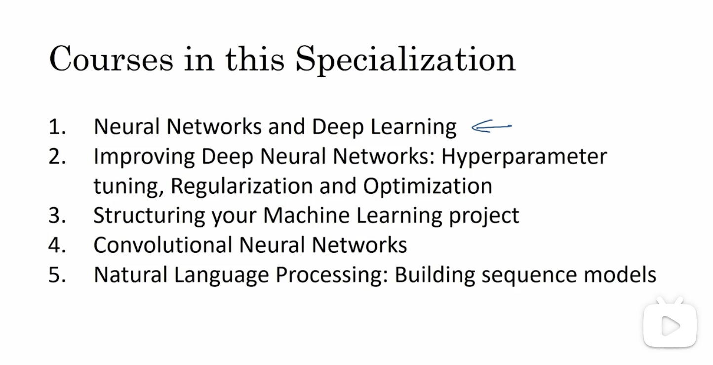

# 2022

## 2022.1.4

### 三年简单小结

从2019.4月开始，拿课余时间学习python已经三年

[Python isn't just Java without the compile](https://bitworking.org/news/2006/08/python_isnt_java_without_the_compile/) 2006老文章，可以做个简单复习

[Some real practical example to teach object-oriented concepts and programming (in python)](https://cseducators.stackexchange.com/questions/6709/some-real-practical-example-to-teach-object-oriented-concepts-and-programming-i) 更新我的问题

[Object Oriented Software Engineering Project](https://cseducators.stackexchange.com/questions/7087/object-oriented-software-engineering-project) 参与讨论

https://www.lucidchart.com/blog/product-owner-roles-and-responsibilities

## 1.13

### controller vs service

[What is the difference between Controllers and Services in Node REST API's?](https://www.coreycleary.me/what-is-the-difference-between-controllers-and-services-in-node-rest-apis/)

[Why should you separate Controllers from Services in Node REST API's?](https://www.coreycleary.me/why-should-you-separate-controllers-from-services-in-node-rest-apis)

我根据这两篇给的给的一个回答 https://cseducators.stackexchange.com/questions/146/what-is-a-good-analogy-for-the-object-oriented-paradigm


## 1.14

### pause container

[What are the pause containers?](https://stackoverflow.com/questions/48651269/what-are-the-pause-containers)

[The Almighty Pause Container](https://www.ianlewis.org/en/almighty-pause-container)

[What is the use of a pause image in Kubernetes?](https://stackoverflow.com/questions/53258342/what-is-the-use-of-a-pause-image-in-kubernetes)

[4 Most Important Kubernetes Interview Questions](https://www.linkedin.com/pulse/4-most-important-kubernetes-interview-questions-raju-kumar-/)

[Using User Namespaces on Docker](https://coderwall.com/p/s_ydlq/using-user-namespaces-on-docker)


## 1.21

### roadmap

https://roadmap.sh/python

dunder methods  [Difference between len() and .__len__()?](https://stackoverflow.com/questions/2481421/difference-between-len-and-len)


## 2.15

### ag

`ag --js "xxx"` 当前目录下， 没有直接对应grep,大致是 `grep -r "xxx" *` 没有简单方法指定文件类型

http://conqueringthecommandline.com/book/frontmatter

用 ag 查了 我在这个问题单里写的代码 https://github.com/nodejs/node/issues/38339  而且也试了node 17.5 确实没有改进

ag 缺省是正则匹配，所以如果搜索函数调用有 `()` 需要  `-Q --literal Do not parse PATTERN as a regular expression. Try to match it literally.` 比如

`ag --js 'randomstring.generate(32)' -Q` 

`-w` 只搜索词 `-C` 指定多少上下文，缺省2行 ，例子 `ag --md -w "ag" -C 3`

比起grep 几大好处， ignore files https://beyondgrep.com/why-ack/

Easy filetype specifications

```
//ignore files
$ grep pattern $(find . -type f | grep -v '\.git')
$ ack pattern
//Easy filetype specifications
$ grep pattern $(find . -name '*.pl' -or -name '*.pm' -or -name '*.pod' | grep -v .git)
$ ack --perl pattern
```

`find` 命令怎么用老是忘了，https://www.linode.com/docs/guides/find-files-in-linux-using-the-command-line/

```
find . -name testfile.txt	 //Find a file called testfile.txt in current and sub-directories.
find /home -name *.jpg	//Find all .jpg files in the /home and sub-directories.
find . -type f -empty	//Find an empty file within the current directory.
find /home -user exampleuser -mtime -7 -iname ".db"	//Find all .db files (ignoring text case) modified in the last 7 days by a user named exampleuser.
```


## 3.16

### color term

以前用 https://pypi.org/project/termcolor/  很多人推荐，但是这个项目好像不更新了。 https://github.com/matthewdeanmartin/termcolor 自称  This is the successor to `termcolor`  但目前只有一颗星。

https://pypi.org/project/colorful/ 目前最多星，但是19年后来没更新 

[How to print colored text to the terminal](https://stackoverflow.com/questions/287871/how-to-print-colored-text-to-the-terminal) 很多答复，选了其中的 https://github.com/bluenote10/yachalk 他提到基于npm的chalk是我选一个原因。

另个看着太复杂，没时间研究 https://click.palletsprojects.com/en/8.0.x/

今天用m1 macOS 12.2 自带 python 3.8 执行之前脚本一直没结果，从 https://www.python.org/ 下3.10 第一次执行也很久，才发现可能是网络问题导致  `git remote add` 需要很长时间，再次执行就好了。所以可能和 3.8也没关系。


### Nullsafe operator

Python 没有，php 8 也开始支持， nodejs 14开始支持 refer to https://wiki.php.net/rfc/nullsafe_operator


## 6.18

### 迷失

有段时间不更新，不知道该把时间花在哪里，学点什么？

以前看过 https://pypi.org/project/watchdog/，现在注意到facebook 有一个 https://github.com/facebook/watchman


## 6.23

### docker

https://snyk.io/blog/best-practices-containerizing-python-docker/

几个问题， MULTI-STAGE BUILDS 里 python 如何知道pip的安装路径 ？怎么知道 venv 估计要再查下 virtualenv 文档 (见 6.28更新)

https://realpython.com/python-wheels/ 有兴趣就看，不是太重要 

WSGI Servers 的概念有兴趣就看看 https://www.fullstackpython.com/wsgi-servers.html

[Building Minimal Docker Containers for Python Applications](https://blog.realkinetic.com/building-minimal-docker-containers-for-python-applications-37d0272c52f3) 对 MULTI-STAGE BUILDS 类似阐述， 注意 “It is important to note that by default Alpine uses musl instead of glibc by default. This means that some Python wheels won’t work without forcing a recompilation.” 

https://testdriven.io/blog/docker-best-practices/ 长 看完


## 6.28

### docker cont.

https://www.docker.com/blog/containerized-python-development-part-1/

> we relied on the *pip’s –user* option to install dependencies to the local user directory and copy that directory to the final image. There are however other solutions available such as virtualenv or building packages as wheels and copy and install them to the final image.

```
# first stage
FROM python:3.8 AS builder
COPY requirements.txt .

# install dependencies to the local user directory (eg. /root/.local)
RUN pip install --user -r requirements.txt

# second unnamed stage
FROM python:3.8-slim
WORKDIR /code

# copy only the dependencies installation from the 1st stage image
COPY --from=builder /root/.local /root/.local
COPY ./src .

# update PATH environment variable
ENV PATH=/root/.local:$PATH

CMD [ "python", "./server.py" ]
```

https://www.docker.com/blog/containerized-python-development-part-2/ 讲docker-compose 用处不很大


## 7.12

#### TOML

https://realpython.com/python-toml/

[Why not TOML?](https://dev.to/siddharthshyniben/why-not-toml-1fj9)

https://realpython.com/python-virtual-environments-a-primer/ 这篇文章更新了几次，比起2020看的时候好像删掉一些有用内容, 改成这句

> A Python virtual environment is just a folder structure. 


## 7.13

### Conda 

[New Release: Anaconda Distribution Now Supporting M1](https://www.anaconda.com/blog/new-release-anaconda-distribution-now-supporting-m1)


### TensorFlow

要使用 Keras 只有安装 tensorflow就可以

安装失败 https://www.tensorflow.org/install

[Could not find a version that satisfies the requirement tensorflow](https://stackoverflow.com/questions/48720833/could-not-find-a-version-that-satisfies-the-requirement-tensorflow) 里面的回答都不对，但`pip install tensorflow-macos` 试了居然可以

```
pip install tensorflow
ERROR: Could not find a version that satisfies the requirement tensorflow (from versions: none)
//但是这个可以
pip install tensorflow-macos 
```

[What is the proper way to install TensorFlow on Apple M1 as conda has supported M1](https://stackoverflow.com/questions/72964800/what-is-the-proper-way-to-install-tensorflow-on-apple-m1-as-conda-has-supported) 我完美总结

但其实 [How to Setup TensorFlow on Apple M1 Pro and M1 Max (works for M1 too)](https://www.mrdbourke.com/setup-apple-m1-pro-and-m1-max-for-machine-learning-and-data-science/) 是我列出四篇文章中最好的

> Let's start by installing various TensorFlow dependencies (TensorFlow is a large piece of software and *depends* on many other pieces of software).
>
> Rather than list these all out, Apple have setup a quick command so you can install almost everything TensorFlow needs in one line.
>
> Apple have created a fork (copy) of TensorFlow specifically for Apple Macs. It has all the features of TensorFlow with some extra functionality to make it work on Apple hardware.
>
> Now we've got base TensorFlow installed, it's time to install `tensorflow-metal`.
>
> Why?
>
> Machine learning models often benefit from GPU acceleration. And the M1, M1 Pro and M1 Max chips have quite powerful GPUs.
>
> TensorFlow allows for automatic GPU acceleration if the right software is installed.
>
> And Metal is Apple's framework for GPU computing.

[What is the difference between miniconda and miniforge?](https://stackoverflow.com/questions/60532678/what-is-the-difference-between-miniconda-and-miniforge) 讨论 mamba [Open Software Packaging for Science](https://medium.com/@QuantStack/open-software-packaging-for-science-61cecee7fc23)

https://github.com/apple/tensorflow_macos

https://developer.apple.com/metal/tensorflow-plugin/

https://blog.tensorflow.org/2021/06/pluggabledevice-device-plugins-for-TensorFlow.html 

[Deep Learning on the M1 Pro with Apple Silicon](https://wandb.ai/tcapelle/apple_m1_pro/reports/Deep-Learning-on-the-M1-Pro-with-Apple-Silicon---VmlldzoxMjQ0NjY3) 性能上一些比较数据

[Installing PyTorch on Apple M1 chip with GPU Acceleration](https://towardsdatascience.com/installing-pytorch-on-apple-m1-chip-with-gpu-acceleration-3351dc44d67c) PyTorch就先放一边

## 7.14

### TensorFlow cont

继续验证tensorflow,  我也加了自己回答，再装一个环境试试。

安装好就需要 Run a Benchmark by training the **MNIST** dataset

https://venturebeat.com/2020/11/18/google-releases-new-version-of-tensorflow-optimized-for-macos/ 解释 `tensorflow-mac` 

*Deep Learning with Python, Second Edition* 看看这回能不能看下去

## 7.18

### pivot

[SQL query to pivot a column using CASE WHEN](https://stackoverflow.com/questions/5846007/sql-query-to-pivot-a-column-using-case-when) 和 https://learnsql.com/blog/case-when-with-sum/ 解释行转列，中文文章 [SQL行转列，列转行](https://zhuanlan.zhihu.com/p/66207434)

Pivot table basics: rows to columns  https://codingsight.com/pivot-tables-in-mysql/

[How to Optimize/Refactor MySQL Pivot Table Performance when using Where Clause](https://stackoverflow.com/questions/58229470/how-to-optimize-refactor-mysql-pivot-table-performance-when-using-where-clause)

[SQL query to pivot a column using CASE WHEN](https://stackoverflow.com/questions/5846007/sql-query-to-pivot-a-column-using-case-when)

[MySQL - Rows to Columns](https://stackoverflow.com/questions/1241178/mysql-rows-to-columns)

https://www.tarynpivots.com/post/how-to-rotate-rows-into-columns-in-mysql/ "MySQL does not have `PIVOT` function, so in order to rotate data from rows into columns you will have to use a `CASE` expression along with an aggregate function."

总结我的问题 [How to improve mysql query performance for the rows to columns pivot table?](https://stackoverflow.com/questions/73107377/how-to-improve-mysql-query-performance-for-the-rows-to-columns-pivot-table)

## 7.19

https://github.com/jeffheaton/t81_558_deep_learning

开始看 Deep Learning with Python, Second Edition, **chapter one**

### neural networks

[Neural Networks](https://www.ibm.com/cloud/learn/neural-networks) Each node, or artificial neuron, connects to another and has an associated **weight** and **threshold**. If the output of any individual node is above the specified threshold value, that node is **activated**, sending data to the next layer of the network. Otherwise, no data is passed along to the next layer of the network.


### SciKit Learn vs TensorFlow vs PyTorch

[Differences in SciKit Learn, Keras, or Pytorch](https://stackoverflow.com/questions/54527439/differences-in-scikit-learn-keras-or-pytorch) "SciKit Learn is not a neural network framework"

[Scikit-learn, TensorFlow, PyTorch, Keras… but where to begin?](https://towardsdatascience.com/scikit-learn-tensorflow-pytorch-keras-but-where-to-begin-9b499e2547d0) "if you want to predict the price of future NBA game tickets, then scikit-learn’s ability to **crunch structured data** is all you need." 就学一种，从简单开始

[What's the difference between scikit-learn and tensorflow? Is it possible to use them together?](https://stackoverflow.com/questions/61233004/whats-the-difference-between-scikit-learn-and-tensorflow-is-it-possible-to-use) 回答没有太多有用信息。

https://www.simplilearn.com/scikit-learn-vs-tensorflow-article scikit-learn能干什么没写出

https://www.simplilearn.com/keras-vs-tensorflow-vs-pytorch-article 帮助不大，因为我已经选定 keras

[Are The New M1 Macbooks Any Good for Data Science? Let’s Find Out](https://towardsdatascience.com/are-the-new-m1-macbooks-any-good-for-data-science-lets-find-out-e61a01e8cad1) 没细看，有机会再看

## 7.20

### keras chapter 2

翻看历史记录 2020.12.25 （圣诞！）看到这一章，一年半之后再次挑战！

[Are The New M1 Macbooks Any Good for Deep Learning? Let’s Find Out](https://towardsdatascience.com/are-the-new-m1-macbooks-any-good-for-deep-learning-lets-find-out-b475ad70dec2) 训练模型的基本代码步骤

[Top 5 Books to Learn Data Science in 2021](https://towardsdatascience.com/top-5-books-to-learn-data-science-in-2020-f43153851f14)

看看 hands-on 关于 MNIST的表述


## 7.21

### chapter 2

Gradient descent

4个系列视频

[Gradient descent, how neural networks learn | Chapter 2, Deep learning](https://www.youtube.com/watch?v=IHZwWFHWa-w) 视频里提到的材料，翻看历史记录2021.5.6 记录看了 http://neuralnetworksanddeeplearning.com/


## 7.26

### MNIST 学习

http://neuralnetworksanddeeplearning.com/chap1.html


## 7.29

### pexpect

翻看记录 2020.9.11研究过相同问题，这次其实又重新解决一次，不过好像也有点小进展

[Is it possbile to let pexpect output the texts it matches?](https://stackoverflow.com/questions/63825774/is-it-possbile-to-let-pexpect-output-the-texts-it-matches) 说明需要 `child.logfile_read = sys.stdout`
这次  [pexpect.interact(): TypeError: write() argument must be str, not bytes](https://stackoverflow.com/questions/73149936/pexpect-interact-typeerror-write-argument-must-be-str-not-bytes) 说明要设置 `child.logfile_read = None` 而且自己上次也提了！！

另外一点教训 `npm ERR! code EOTP` 就说OTP输错了，因为邮件太多看混了，以为脚本有问题。


## 8.15

### for...loop vs itertools

[You (Probably) Don’t Need For-Loops](https://medium.com/python-pandemonium/never-write-for-loops-again-91a5a4c84baf) 这个是一直都需要注意，文章提到 itertools 再学习一下

https://www.educative.io/answers/what-are-itertools-in-python

https://www.pythoncheatsheet.org/modules/itertools-module 另 https://www.pythoncheatsheet.org/ 对python 知识点分类比较清晰，但讲解不全面

开始没明白 `groupby` 看了 [itertools and functools : Two Python Lone Soldiers](https://towardsdatascience.com/itertools-and-functools-two-python-lone-soldiers-7d3400495c89) 没看全


> Every time the value of the key function changes, it creates a break or a new group. This is in contrast to SQL’s GROUP BY, which groups similar data irrespective of the order. So it is important to sort the data in the first place before passing it to itertools.groupby .

...

> *key* specifies a function of one argument that is used to extract a comparison key from each element in *iterable* (for example, `key=str.lower`).

https://realpython.com/python-itertools/ 也没看全

另外注意一点 [pythonic way to do something N times without an index variable](https://stackoverflow.com/questions/2970780/pythonic-way-to-do-something-n-times-without-an-index-variable) 和 https://www.delftstack.com/howto/python/python-repeat-n-times/ (它的howto 系列内容太多太杂了)

```
for _ in range(num): 
for _ in itertools.repeat(None, num):
```

The `itertools.repeat(val, num)` method is an infinite iterator, which means it will iterate infinitely till the `break` statement if the `num` value (which represents the number of iterations) is not provided. The `val` parameter of this method represents the value that will be printed on each iteration.

As we want to repeat the iteration N times, we will pass the value of N to the `num` argument and `None` value to the `val` argument since we do not need to print anything. The `itertools.repeat()` method is more efficient than the `range()` method, but the `itertools` module needs to be imported to use this method.


## 8.16

### pager

[Too many tags so `git tag` will stop with a colon for further input](https://stackoverflow.com/questions/73368830/too-many-tags-so-git-tag-will-stop-with-a-colon-for-further-input)

[What is a pager?](https://unix.stackexchange.com/questions/144016/what-is-a-pager) 和 [Git-Config: core.pager](https://medium.com/pragmatic-programmers/git-config-core-pager-807e17d64243)

`git --no-pager tag -l "v[123467].*"` -l 支持的pattern 是 The pattern is a shell wildcard (i.e., matched using [fnmatch](https://docs.python.org/3/library/fnmatch.html) , 4个模式 * ?, `[seq]` 和 `[!seq]` 以前没注意

[How to tell which commit a tag points to in Git?](https://stackoverflow.com/questions/1862423/how-to-tell-which-commit-a-tag-points-to-in-git) 发现`git show-ref --abbrev=7 --tags` 没用pager (看VonC更新答复)， `git rev-list -1` 找到tag对应的commit id


[subprocess wildcard usage](https://stackoverflow.com/questions/9997048/subprocess-wildcard-usage)

https://devconnected.com/how-to-delete-local-and-remote-tags-on-git/


[Problems with command using * wildcard in subprocess](https://stackoverflow.com/questions/12267774/problems-with-command-using-wildcard-in-subprocess)

[subprocess wildcard usage](https://stackoverflow.com/questions/9997048/subprocess-wildcard-usage)

```
qiulang@qiulangdeMacBook-Air wechat % git --no-pager tag -l [v]5.*
zsh: no matches found: [v]5.*
qiulang@qiulangdeMacBook-Air wechat % git --no-pager tag -l "[v]5.*"
v5.4.0
v5.5.0
v5.5.1
v5.6.0
v5.7.0
v5.7.1
v5.7.2

所以我的代码开始写

'git --no-pager tag -l "[v]5.*"'
result = run(command.split(), stdout=PIPE, stderr=PIPE) 执行没有结果，需要改成
result = run(command, shell=True, stdout=PIPE, stderr=PIPE)

突然意识我的命令不需要shell执行，所以其实是 [v]5.* 不需要引号
'git --no-pager tag -l [v]5.*'
result = run(command.split(), stdout=PIPE, stderr=PIPE)
```


## 8.17

### argparse bool

bool 参数好像没什么好办法，翻看以前记录也没有, [A Simple Guide To Command Line Arguments With ArgParse](https://towardsdatascience.com/a-simple-guide-to-command-line-arguments-with-argparse-6824c30ab1c3) 也没写

**flag 参数** ('-' 或'--' 开始) 设置缺省值是一个办法，不给就用缺省值 false,给了就true， **position 参数**不好，因为position参数导致必填（即便有缺省值），而必填值只有空串是false。而且position参数也不好记。


## 8.26

### keras chapter 2 cont.

继续 7.20记录 从 **2.4.1 What’s a derivative?** 再次开始

https://www.mathsisfun.com/gradient.html   gradient 即 slope 这个网站以前访问过 mathsisfun

https://www.mathsisfun.com/calculus/derivatives-introduction.html  derivative of a function

和书上写的正相反 "The slope a is called the *derivative* of f in p", 不过 “The derivative of a tensor operation (or tensor function) is called a *gradient*.


## 9.11

### chapter 5 "The mechanics of learning"

keras chapter 2.4 几次都翻不过去，开始觉得是书写得有问题了。所以换 "Deep learning with PyTorch2" chapter 5 "The mechanics of learning"

安装 pytorch 很简单 ，明天验证 https://pytorch.org/get-started/locally/

[What is the difference between pip and conda?](https://stackoverflow.com/questions/20994716/what-is-the-difference-between-pip-and-conda) 没空看

pytorch 的 MNIST 例子可以找时间看看 https://pytorch.org/tutorials/recipes/recipes/defining_a_neural_network.html#defining-a-neural-network-in-pytorch 

[Installing Tensorflow on Apple M1 With the New Metal Plugin](https://betterprogramming.pub/installing-tensorflow-on-apple-m1-with-new-metal-plugin-6d3cb9cb00ca) 提到验证 MNIST 层级和ts书里说的不一样有时间验证。


### conda commands

如何 [How do I prevent Conda from activating the base environment by default?](https://stackoverflow.com/questions/54429210/how-do-i-prevent-conda-from-activating-the-base-environment-by-default)

Conda cheatsheet 和 https://conda.io/projects/conda/en/latest/user-guide/getting-started.html


### python knowledge

https://realpython.com/python-strings/

https://www.runoob.com/python/att-string-center.html "字符串字符数为奇数时左侧字符会比右侧少 1，字符串字符数为偶数时左侧字符会比右侧多 1"

[How to implement center() by padding the extra character always on the left?](https://stackoverflow.com/questions/73699051/how-to-implement-center-by-padding-the-extra-character-always-on-the-left)


## 9.19

### Deep learning with PyTorch2

快速浏览完第五章（对应keras chapter 2.4 ），觉得应该从第三章重新看起。


## 10.1 假期

### pytorch chapter 3-5

[Pip vs Conda: an in-depth comparison of Python’s two packaging systems](https://pythonspeed.com/articles/conda-vs-pip)

Grokking Deep Learning-2019 chapter 4 -- chapter 6 上一次看 [2021.12.16](readme2021.md#12.16)  😓

OReilly.Hands-on.Machine.Learning.with.Scikit-Learn.Keras.and.TensorFlow.2nd.2019.9  **Gradient Descent**


### YouTube  [3Blue1Brown](https://www.youtube.com/c/3blue1brown)

1. [But what is a neural network? | Chapter 1, Deep learning](https://www.youtube.com/watch?v=aircAruvnKk)
2. [Gradient descent, how neural networks learn | Chapter 2, Deep learning](https://www.youtube.com/watch?v=IHZwWFHWa-w)
3. [What is backpropagation really doing? | Chapter 3, Deep learning](https://www.youtube.com/watch?v=Ilg3gGewQ5U)
4. [Backpropagation calculus | Chapter 4, Deep learning](https://www.youtube.com/watch?v=tIeHLnjs5U8&t=134s)

*Backpropagation* 需要再学习

翻看记录 [7.21](#7.21)都看过视频学习过，又过了三个月。再翻看 gradient descent 学习记录[2021.6.21](readme2021.md#6.21) 第一次学习，第一次读DP的三本书是在 [2020.12.15](readme2020.md#12.15) 太可悲了，都快两年了！😅

小问题  [What is :: (double colon) in Python when subscripting sequences?](https://stackoverflow.com/questions/3453085/what-is-double-colon-in-python-when-subscripting-sequences)  `[::-1]`就是翻转


## 10.12-26

### Grokking Deep Learning

现在决定把grokking 这本看完， 10.25 看到 第八章，但是有些代码要自己敲，执行一下

[Practical Deep Learning for Coders](https://course.fast.ai/) 这个网站还没看


## 10.26

### full text search

https://www.mongodb.com/basics/full-text-search  "To perform a full-text search in a database, you must create an index. The index acts as a glossary of all the words in the indexed fields with reference to the specific documents. When a query is performed, the engine searches the index and finds all matching documents. In MySQL, this would be done with the FULLTEXT keyword... To use features such as fuzzy search, typo tolerance, or synonyms, you will need to add a core search engine such as Apache Lucene on top of your database."

**Considerations before using full-text search** 读读 

**Features**

1. Rich Querying Capabilities ... geo points and dates
2. Fuzzy Search
3. Synonyms
4. Custom Scoring
5. Autocomplete
6. Highlights

但是居然没提 stop words的概念 https://www.postgresql.org/docs/current/textsearch-intro.html

[Full-Text Searches in MySQL: The Good, the Bad and the Ugly](https://severalnines.com/blog/full-text-searches-mysql-good-bad-and-ugly)

[MySQL full text search with partial words](https://stackoverflow.com/questions/2716748/mysql-full-text-search-with-partial-words) 只能前缀 prefixes 搜索


### 前缀模糊匹配

[Optimising LIKE expressions that start with wildcards](https://stackoverflow.com/questions/41879054/optimising-like-expressions-that-start-with-wildcards) 答复和 [Making Queries With Leading Wildcards Faster](http://blog.sqlgrease.com/making-queries-with-leading-wildcards-faster/)

[SQL query with Like operator with Leading Wildcards](https://dba.stackexchange.com/questions/252315/sql-query-with-like-operator-with-leading-wildcards)

Avoid `LIKE` expressions with leading wildcards https://use-the-index-luke.com/sql/where-clause/searching-for-ranges/like-performance-tuning

2023.4.13又碰了一次 参见 [Improving performance of query using Like operator](https://stackoverflow.com/questions/50135597/improving-performance-of-query-using-like-operator) [Bill Karwin](https://stackoverflow.com/users/20860/bill-karwin)的回答 "There is no way to improve the performance of `LIKE` when you have a wildcard at the start of your pattern... Unless your pattern has no wildcard at the start, it's forced to do a table-scan. It can't use an index. " 

## 10.27

### sqlite3 FTS

[Escape single quote character for use in an SQLite query](https://stackoverflow.com/questions/603572/escape-single-quote-character-for-use-in-an-sqlite-query) 不要用`\` 做 escape 字符，不然sqlite3 command shell 就是不结束

创建fts5表需要 `Porter Tokenizer` 才能做 This allows search terms like "correction" to match similar words such as "corrected" or "correcting". 不过还好这个只适用于英语，对我们影响不大。

但是 mysql 好像还没实现stemmeing [Stemming for full-text](https://dev.mysql.com/worklog/task/?id=2423) "we'll go with the  "Porter stemming algorithm" (also known as the "**Porter stemmer**") because it's popular."

我自己之前（2017）参与过 [SQL full text search vs "LIKE"](https://stackoverflow.com/questions/478472/sql-full-text-search-vs-like)

[What is Full Text Search vs LIKE](https://stackoverflow.com/questions/224714/what-is-full-text-search-vs-like) 今天测试10万条数据，发现中文fts性能居然比like差不多。添加到120万数据看到差别，但没有那么大，估计是测试数据短  "Adding wild card adds to the mess. It works great for small length strings, as you can imagine, but will fail miserably for longer sentences. And definitely not comparable when having a paragraph or a whole page of text etc."

### mysql ngram_token_size

[ngram Full-Text Parser](https://dev.mysql.com/doc/refman/5.7/en/fulltext-search-ngram.html)

```
mysqld --ngram_token_size=1 //不生效
```


https://www.mysqltutorial.org/mysql-ngram-full-text-parser/

```
show variables like '%token%';
```


[Can I use VARCHAR as the PRIMARY KEY?](https://stackoverflow.com/questions/19299874/can-i-use-varchar-as-the-primary-key) "your primary key should generally be some "meaningless" value, such as an auto-incremented number or a GUID.  in most situations, values that have a meaning outside your database system should *not* be chosen to be a primary key."

[Fulltext Search with InnoDB](https://stackoverflow.com/questions/1381186/fulltext-search-with-innodb)


[MySQL - How to search a single character with fulltext index](https://stackoverflow.com/questions/57231378/mysql-how-to-search-a-single-character-with-fulltext-index)


## 10.28

### MySQL

[Possible INDEX on a VARCHAR field in MySql](https://dba.stackexchange.com/questions/35821/possible-index-on-a-varchar-field-in-mysql) 

[How to copy files from one machine to another using ssh](https://unix.stackexchange.com/questions/106480/how-to-copy-files-from-one-machine-to-another-using-ssh)


## 11.2

MySQL FTS 的问题不少，总结在组里文档


## 11.10

Grokking 6章最后的例子跑一遍，对照 https://github.com/iamtrask/Grokking-Deep-Learning

为什么 numpy例子 matrix 需要 `.T` ? 一下想明白了，不把行转成列，相应矩阵运算就是错的！

周末把第六章最后一个例子跑下


## 12.4

### Grokking chapter 6

第六章最后一个例子一直没搞懂，发现也有别人提了同样的问题 [Chapter 6 - Array in array vs use vector](https://github.com/iamtrask/Grokking-Deep-Learning/issues/58)

综合他的例子，我进一步体会是因为这个DP只有一个输出，所以现在这样做看着确实复杂，但如果是一个vector输出，估计就得这么做。明天开始接着看第八章。不过他的示例代码确实有启发，比书上示例好懂多了

```
weights_1 = np.array([ [ -0.16595599,  0.44064899, -0.99977125, -0.39533485 ],
                       [ -0.70648822, -0.81532281, -0.62747958, -0.30887855 ],
                       [ -0.20646505, 0.07763347, -0.16161097,  0.370439 ] ] )

weights_2 = np.array([ -0.5910955, 0.75623487, -0.94522481, 0.34093502 ])

street_lights = np.array( [ [ 1, 0, 1 ],
                            [ 0, 1, 1 ],
                            [ 0, 0, 1 ],
                            [ 1, 1, 1 ]])

walk_vs_stop = np.array([1, 1, 0, 0])

for iteration in range(60):
    sum_error = 0
    for i in range(len(street_lights)):        
        layer_0 = street_lights[i]        
        layer_1 = relu(np.dot(layer_0, weights_1))
        layer_2 = np.dot(layer_1, weights_2)
        
                     
        sum_error += (layer_2 - walk_vs_stop[i]) ** 2        
        
        delta_2 = layer_2  - walk_vs_stop[i]
        delta_1 = np.dot(delta_2, weights_2) * relu2deriv(layer_1)
        
        
        weights_2 -= alpha * layer_1.dot(delta_2)        
        weights_1 -= alpha * np.dot(np.array([layer_0]).T, np.array([delta_1]))
       
    print(sum_error)
```


# 2023

## 2023.1.3

该开始 Grokking chapter 8

在这之前复习一下 `dataclass` 和 `namedtuple`, By design, a `namedtuple` is a regular tuple.

[9 Reasons Why You Should Start Using Python Dataclasses](https://towardsdatascience.com/9-reasons-why-you-should-start-using-python-dataclasses-98271adadc66)

1. Easy conversion to a tuple or a dictionary  `from dataclass import astuple, asdict`

[How to remove items from a list while iterating?](https://stackoverflow.com/questions/1207406/how-to-remove-items-from-a-list-while-iterating)


## 2023.1.4

### mnist again

重建 conda env , 几个命令打错了, 正确命令 `conda env create -f env.yaml`

```
qiulang@loaclhost conda-learn % conda create --file env.yaml
usage: conda create [-h] [--clone ENV] (-n ENVIRONMENT | -p PATH) [-c CHANNEL] [--use-local] [--override-channels] [--repodata-fn REPODATA_FNS]
                    [--strict-channel-priority] [--no-channel-priority] [--no-deps | --only-deps] [--no-pin] [--copy] [-C] [-k] [--offline] [-d] [--json] [-q]
                    [-v] [-y] [--download-only] [--show-channel-urls] [--file FILE] [--no-default-packages]
                    [--experimental-solver {classic,libmamba,libmamba-draft}] [--dev]
                    [package_spec ...]
conda create: error: one of the arguments -n/--name -p/--prefix is required
qiulang@loaclhost conda-learn % conda create --file env.yaml -n tf-2023

CondaValueError: could not parse 'name: tf-metal' in: env.yaml

qiulang@loaclhost conda-learn % conda create -n tf-2023 --file env.yaml

CondaValueError: could not parse 'name: tf-metal' in: env.yaml

qiulang@loaclhost conda-learn % conda env create -f env.yaml
```

然后执行下面简单命令，但是因为网络原因会报错，所以要用vpn (所以原来env tf2是正确的，只是当时没开vpn)
```
import sys, numpy as np
from keras.datasets import mnist

(x_train, y_train), (x_test, y_test) = mnist.load_data()
print(y_train.shape)
# 输出
Downloading data from https://storage.googleapis.com/tensorflow/tf-keras-datasets/mnist.npz
11490434/11490434 [==============================] - 4s 0us/step
(60000,)
```

关于  mnist.load_data 说明 https://www.tensorflow.org/api_docs/python/tf/keras/datasets/mnist/load_data

```
(x_train, y_train), (x_test, y_test) = keras.datasets.mnist.load_data()
assert x_train.shape == (60000, 28, 28)
assert x_test.shape == (10000, 28, 28)
assert y_train.shape == (60000,)
assert y_test.shape == (10000,)
```

[Chapter 8 examples, why do they all turn label into one_hot_labels ](https://github.com/iamtrask/Grokking-Deep-Learning/issues/63) 有人回答。

### mamba

手欠安装一下mamba，果然除了问题

```
qiulang@qiulangdeMacBook-Air conda-learn % conda env list
# conda environments:
#
base                     /Users/qiulang/mambaforge
tf-metal                 /Users/qiulang/mambaforge/envs/tf-metal
                         /Users/qiulang/opt/miniconda3
                         /Users/qiulang/opt/miniconda3/envs/pexpect-test
                         /Users/qiulang/opt/miniconda3/envs/pythonProject
                         /Users/qiulang/opt/miniconda3/envs/snakes
                         /Users/qiulang/opt/miniconda3/envs/snowflakes
                         /Users/qiulang/opt/miniconda3/envs/tf-metal
```

果然有人一样碰到，解答没细看了  [conda environment has no name visible in conda env list - how do I activate it at the shell?](https://stackoverflow.com/questions/57527131/conda-environment-has-no-name-visible-in-conda-env-list-how-do-i-activate-it-a)


### pip vs conda

1. [Pip vs Conda](https://pythonspeed.com/articles/conda-vs-pip) 解释了 wheels
2. https://www.anaconda.com/blog/understanding-conda-and-pip

两篇都提到conda里使用pip的问题，这是我以前没注意的，比如 numpy 和panda就可以直接作为 dependencies 而不是在pip里


## 2.1

### chapter 8

[Chapter 8 examples, why do they all turn label into one_hot_labels ](https://github.com/iamtrask/Grokking-Deep-Learning/issues/63) 有人回答是 "It converts an int into an array of 0's and one 1, so number "2" will be converted to [0,0,1,0,0,0,0,0,0,0]. The final prediction is of same type an array of size 10, so for each digit you get its own prediction." 这个其实我自己也想明白，因为 每张图的预测结果就是一个 (10,)的一维数组，这样才能把预测结果和实际结果算误差。但是它的实现其实和第六章我的疑问一样  [Chapter 6 - Array in array vs use vector](https://github.com/iamtrask/Grokking-Deep-Learning/issues/58) ，为什么要用二维数组?

```
for i in range(len(images)):
    layer_0 = images[i:i+1] # why not change to layer_0 = images[i]
    layer_1 = relu(np.dot(layer_0,weights_0_1))
    layer_2 = np.dot(layer_1,weights_1_2)
    error += np.sum((labels[i:i+1] - layer_2) ** 2)  # then we use labels[i]
    ...
```


###  数据STUDIO 公号文章

1. 为在 Python 中，空序列和集合的计算结果为 False。所以这可以应用于字符串、元组、列表、字典和集合 （和js一样）

2. `any` 和 `all`:`has_positives = any(n > 0 for n in numbers)` 

3. 使用`|`操作符来合并两个不同的字典

4. `a, b, *c = [1,2,3,4,5]`

5. https://note.nkmk.me/en/python-itertools-product/  3.9 才有

   ```
   t = ('one', 'two')
   d = {'key1': 'value1', 'key2': 'value2'}
   r = range(2)
   
   l_p = list(itertools.product(t, d, r))
   
   pprint.pprint(l_p)
   # [('one', 'key1', 0),
   #  ('one', 'key1', 1),
   #  ('one', 'key2', 0),
   #  ('one', 'key2', 1),
   #  ('two', 'key1', 0),
   #  ('two', 'key1', 1),
   #  ('two', 'key2', 0),
   #  ('two', 'key2', 1)]
   ```

   

一个敏捷问题被**快速关闭**  [Agile vs Introverts, any study to show they may not work well?](https://softwareengineering.stackexchange.com/questions/443808/agile-vs-introverts-any-study-to-show-they-may-not-work-well) 不死心，再问 [How do I make agile process more comfortable for introverts?](https://workplace.stackexchange.com/questions/189958/how-do-i-make-agile-process-more-comfortable-for-introverts)


### sql like with leading wildcard

[Query to bring count from comma separated Value](https://stackoverflow.com/questions/13908379/query-to-bring-count-from-comma-separated-value)看 [Bill Karwin](https://stackoverflow.com/users/20860/bill-karwin) 的回答

[MySQL querying relational tables](https://stackoverflow.com/questions/6862369/mysql-querying-relational-tables)  [Bill Karwin](https://stackoverflow.com/users/20860/bill-karwin) 的回答

[SQL Wildcard Search - Efficiency?](https://stackoverflow.com/questions/11795770/sql-wildcard-search-efficiency)

fts 看来是正解


## 2.23

### "Grokking DP"

终于看完第8章，开始看第9章  activation functions

第八章要记住名词 Regularization


## 3.16

### declarative vs imperative again

读 [The evolution of Facebook’s iOS app architecture](https://engineering.fb.com/2023/02/06/ios/facebook-ios-app-architecture/) 提到 declarative 和 双向绑定。提到 react 触发 Declarative Programming — SwiftUI， 2021年 12 曾经记**The dream of declarative programming** 这次针对 SwiftUI 再复习一下

[Declarative and Imperative Programming using SwiftUI and UIKit](https://medium.com/@rmeji1/declarative-and-imperative-programming-using-swiftui-and-uikit-c91f1f104252)

>  A major advantage of learning and using SwiftUI is allowing for cross-platform development for the different operating systems within the Apple ecosystem. No more having to learn four different frameworks if you want to build an app that has components on Apple Watch, Apple TV, MacBook Pro, and finally your iPhone.

文章比较了 UIKit  和  SwiftUI 的不同写法，提到 双向绑定

[Is SwiftUI framework declarative or imperative or neither?](https://stackoverflow.com/questions/56914884/is-swiftui-framework-declarative-or-imperative-or-neither) 有一个回答 “when one adds a tap handler to a view element, one can subtly shift from the “what” of declarative programming to the “how” of imperative programming, as you outline a series of steps to be taken to achieve some task.”

### ts 4.9 `satisfies` Operator 

https://devblogs.microsoft.com/typescript/announcing-typescript-4-9/

```
const palette = {
    red: [255, 0, 0],
    green: "#00ff00",
    bleu: [0, 0, 255]
//  ^^^^ sacrebleu - we've made a typo!
};

type Colors = "red" | "green" | "blue";

type RGB = [red: number, green: number, blue: number];

const palette: Record<Colors, string | RGB> = {
    red: [255, 0, 0],
    green: "#00ff00",
    bleu: [0, 0, 255]
//  ~~~~ The typo is now correctly detected
};
//但是 red 可以是 string

type Colors = "red" | "green" | "blue";

type RGB = [red: number, green: number, blue: number];

const palette = {
    red: [255, 0, 0],
    green: "#00ff00",
    bleu: [0, 0, 255]
//  ~~~~ The typo is now caught!
} satisfies Record<Colors, string | RGB>;

type RGB = [red: number, green: number, blue: number];

const palette = {
    red: [255, 0, 0],
    green: "#00ff00",
    blue: [0, 0]
    //    ~~~~~~ error!
} satisfies Record<string, string | RGB>;
```

[new Typescript "satisfies" operator](https://stackoverflow.com/questions/73909490/new-typescript-satisfies-operator) "the information about what keys and values it contains is preserved "


### 文章阅读

[The JetBrains Fleet Blog](https://blog.jetbrains.com/zh-hans/fleet/) 六部分

架构细读了 https://blog.jetbrains.com/zh-hans/fleet/2022/01/fleet-below-deck-part-i-architecture-overview/ 

[Devpod: Improving Developer Productivity at Uber with Remote Development](https://www.uber.com/en-JP/blog/devpod-improving-developer-productivity-at-uber/) 只能是初步了解，知道他们用k8s 来构建他们的开发环境

https://blog.pragmaticengineer.com/oncall-compensation/ 加班文化调查，专门提到Amazon, 过去痛苦回忆

> Engineering managers – called SDMs (Software Development Managers) – at Amazon have been known to step in and try to ease the oncall load by offering days off. As a current Amazon engineer shares:
>
> “After rough oncalls in the Alexa Devices organization, several SDMs have been lenient with PTO to compensate (if up late, then come in late, if working the weekend, then take an extra day off, etc.) This was not an official policy and any change-ups in the manager (like a re-org which happened somewhat often) and any accumulated off-the-books PTO time would vanish.”
>
> However, I have heard several stories of staff suffering extreme burnout due to Amazon’s relentless oncall load, and this burnout persisting with them to their next position. A software engineer I talked with shared how they burnt out so badly because of Amazon’s oncall culture, that they struggled during the first several months of their next job at a startup, as they were recovering mentally and physically from the oppressive operations load at Amazon.


## 4.14

### Grokking DP Chapter 9

第九章重新看起


## 4.25

### copilot

使用 copilot两个问题，1. 关于注释  https://realpython.com/python-comments-guide/  2. https://realpython.com/python-doctest/  doctest 以前不知道，要学习一下。 https://docs.python.org/3/library/doctest.html  这两篇文章都长，单独再找个时间看


单元测试代码个源代码是不是可以再同一个文件，比如 doctest ； 在同一个文件弊端 [Writing basic unit-tests inside the class file](https://softwareengineering.stackexchange.com/questions/357283/writing-basic-unit-tests-inside-the-class-file)  这个问题让我知道 doctest  [Is there a reason that tests aren't written inline with the code that they test?](https://softwareengineering.stackexchange.com/questions/188316/is-there-a-reason-that-tests-arent-written-inline-with-the-code-that-they-test) 有个回答 

> It is worth observing that in the early days, Java programmers used to do this kind of thing; e.g. including a `main(...)` method in a class to facilitate testing. This idea has almost completely disappeared. It is industry practice to implement tests separately using a test framework of some kind.

我自己的 ws_redis 也曾经把测试代码放在实际代码里，就是起了几秒之后停止，为了让测试脚本确认容器能正常启动。但后来我自己也放弃了。

copilot 和 cursor.so 联合使用 

### doctest


## 5.12

### doctest

几个学习任务 1. doctest 2. 当年那个css 演示网站找出来 3. chatgpt能否帮助 css 和 sql 4. Midjourney 5. Copilot/copilot lab/ cursor能不能完整扫描一遍我们的代码？6. 接着那个ssh 代码

Google `python library most downloaded` 大多结果体现 ML 的库，但是这篇不是，内容还不错 [Top 15 Most Popular Python Libraries, 100 million + Downloads!](https://medium.com/geekculture/top-15-most-popular-python-libraries-100-million-downloads-9b71452d717e) 

css 那个网站找不到了 但是 https://web.dev/learn/css/ 还可以  可能是 https://www.csszengarden.com/ 或者 https://ishadeed.com/article/same-html-different-css/ Google  `same html different css effect`

[Can ChatGPT write decent HTML and CSS?](https://stakedesigner.com/can-chatgpt-write-decent-html-and-css/) 不能像对SQL一样提出优化意见，只能写基本的，但是copilot补全应该可以。

解决 [How do I let silver searcher ignore certain sub-directories?](https://stackoverflow.com/questions/76233155/how-do-i-let-silver-searcher-ignore-certain-sub-directories) 


ChatGPT 做交互设计 ：

1. https://tldv.io/blog/chatgpt-prompts-for-ux-design/
2. https://www.thefountaininstitute.com/blog/chat-gpt-ux-design 提示词小结，不过已经很熟悉了
3. [10 Best Ways to Use ChatGPT as a UX Designer](https://uxplanet.org/10-best-ways-to-use-chatgpt-as-a-ux-designer-5dd569b99edc)


## 5.17 ChatGPT UI/UX

几个关于提示词的例子，但是我基本知晓

[4 Cool Ways to Use ChatGPT for UI/UX Design]([4 Cool Ways to Use ChatGPT for UI/UX Design | by Joseph Kelly | Bootcamp](https://bootcamp.uxdesign.cc/4-cool-ways-to-use-chatgpt-for-ui-ux-design-cf3a34079689))

[Ultimate ChatGPT Cheatsheet for UX UI Designers | UX Planet](https://uxplanet.org/ultimate-chatgpt-cheatsheet-for-ux-ui-designers-63c813fc859a)


## 5.23

### 几篇 doctest

https://snyk.io/blog/how-to-write-tests-in-python-using-doctest/ 最简单

[How To Write Doctests in Python](https://www.digitalocean.com/community/tutorials/how-to-write-doctests-in-python) 但是如果我的python就是要在 `__main__` 下跑怎么办，看下面引申

```
if __name__ == "__main__":
    import doctest
    doctest.testmod()
```

https://realpython.com/python-doctest/ 长 `python -m doctest -v calculations.py`

> The second way to run your `doctest` tests with `testmod()` is to create a dedicated test runner file. For example, if you want to run the tests in `calculation.py` without modifying the module itself, then you can create a `run_module_tests.py` file with the following content:
>
> you need to import the target module, `calculations`, and pass the module object as the first argument to `testmod()`. 

```
# run_module_tests.py

import doctest

import calculations

doctest.testmod(calculations, verbose=True)
```

引申  [Executing modules as scripts](https://docs.python.org/3/tutorial/modules.html)

> A module is a file containing Python definitions and statements. The file name is the module name with the suffix `.py` appended. Within a module, the module’s name (as a string) is available as the value of the global variable `__name__`.

> you can make the file usable as a script as well as an importable module, This is often used either to provide a convenient user interface to a module, or for testing purposes (running the module as a script executes a test suite).

所以 `doct2.py`例子是对的，不管是 `python3 doct2.py -v ` 还是 `python3 -m doctest -v doct2.py` 因为在module级有自己的测试用例。

[Python - doctest vs. unittest](https://stackoverflow.com/questions/361675/python-doctest-vs-unittest) 

[Python Documentation Testing, doctest, Marcin Kozak | Towards Data Science](https://towardsdatascience.com/python-documentation-testing-with-doctest-the-easy-way-c024556313ca) 长，没细看

> Python offers several testing frameworks, currently three of the most popular being `pytest` and built-in `unittest` and `doctest`. The first two are focused on unit testing. `doctest` is different, its main purpose — but *definitely* not the only one — being documentation testing.

但是 doctest 在md文件 有点意思 `python3 -m doctest -v doct1.md` 

参见 [python: doctest my github-markdown files?](https://stackoverflow.com/questions/23250068/python-doctest-my-github-markdown-files)


## 6.5

### context manager

https://realpython.com/python-with-statement/

[Is Python *with* statement exactly equivalent to a try - (except) - finally block?](https://stackoverflow.com/questions/26096435/is-python-with-statement-exactly-equivalent-to-a-try-except-finally-bloc)

[Python Coding Tip: Using the ‘With’ Statement Instead ‘Try…Finally’](https://medium.com/swlh/python-coding-tip-using-the-with-statement-instead-try-finally-f45a645c6008)


## 7.6

### socket

https://realpython.com/python-sockets/

没写 对应nodejs的 `socket.on('end'`是什么

https://docs.python-guide.org/writing/tests/ 测试


## 9.8

### discord bot

[Python Discord Bot Tutorial – Code a Discord Bot And Host it for Free](https://www.freecodecamp.org/news/create-a-discord-bot-with-python/)

https://discordpy.readthedocs.io/en/stable/discord.html


## 9.18

### openapi 

了解 [What is Open API?](https://document360.com/blog/open-api/) 和 [Open API vs. REST API - difference](https://stackoverflow.com/questions/48123867/open-api-vs-rest-api-difference)

### GraphQL

GraphQL 了解,  GraphQL vs RESTful

https://blog.logrocket.com/graphql-vs-rest-api-why-you-shouldnt-use-graphql/ 

> The main benefit of using GraphQL is the ability to send a query that specifies only the information you need and receiving exactly that. 
>
> ...
>
> GraphQL, on the other hand, returns the `200 Ok` status for every API request, including for errors. 

GraphQL 处理错误方式很像我很久以前提过的问题 [Any problem with catch rejected promise and turn it into resolved with error code?](https://stackoverflow.com/questions/54251635/any-problem-with-catch-rejected-promise-and-turn-it-into-resolved-with-error-cod)

https://aws.amazon.com/compare/the-difference-between-graphql-and-rest/  

> Overfetching and underfetching

### Docker Compose

[use cases of Docker Compose](https://docs.docker.com/compose/features-uses/#have-multiple-isolated-environments-on-a-single-host)

https://github.com/docker/awesome-compose


## 10.1 国庆

国庆最后两天开始在B站找 吴恩达课程和李沫视频

吴恩达视频有两个 , 一个是 [克隆 deeplearning.ai](https://www.bilibili.com/video/BV1UF411f7cb?p=1&vd_source=2d4a4f84686757c41419a583cec98806) 182节视频 ，内容较多，目前看第二个视频

一个是 [克隆 coursera](https://www.bilibili.com/video/BV1pm4y1T7wx?p=1&vd_source=2d4a4f84686757c41419a583cec98806) 142 视频，比较简单，目前看这个。这两个课程到底差异在哪，还没看出。

同时也看了一些李沫视频，以及他的书 https://d2l.ai/ "Dive into Deep Learning"


## 10.8

### 再次python 环境问题


pip安装包到底安装到什么path, 注意 [Why is a tilde in a path not expanded in a shell script?](https://stackoverflow.com/questions/32276909/why-is-a-tilde-in-a-path-not-expanded-in-a-shell-script)

```
pip3 list -v
python3 -m site  #Global site-packages 
python3 -m site --user-site #per user
```

为 https://d2l.ai/chapter_installation/index.html 做准备 李沫的书

https://code.visualstudio.com/docs/python/environments 和 https://docs.python.org/3/using/cmdline.html#environment-variables

https://docs.python.org/3/using/mac.html  提到几个问题：**1.** 我以前问的 [What does Python Launcher do?](https://apple.stackexchange.com/questions/356243/what-does-python-launcher-do) 没用，鸡肋不要用 **2.** 如何删除python 安装，这里也提到 [How to remove one old python installation from a system with multiple (non-system) installations of python](https://apple.stackexchange.com/questions/17709/how-to-remove-one-old-python-installation-from-a-system-with-multiple-non-syste) **3.** 解释 **pythonw** 我之前应该也是困惑过 **4.** 苹果论坛 [How to setup Python 3.9.2 Default](https://discussions.apple.com/thread/252499858) 和官网说的一样。

以下两篇没看

[How to set up virtual environments for Python on a Mac](https://opensource.com/article/19/6/python-virtual-environments-mac)

[The right and wrong way to set Python 3 as default on a Mac](https://opensource.com/article/19/5/python-3-default-mac)


更新问题 [Should I set PYTHONPATH for the pre-install python on MacOS 13 M1/M2?](https://apple.stackexchange.com/questions/465113/should-i-set-pythonpath-for-the-pre-install-python-on-macos-13-m1-m2) 这个是我不想要的设置path的方式 https://developer.apple.com/forums/thread/722888


安装了 httpie 还是装了 python 3.10 还好没有该系统的python3

```
--->  Some of the ports you installed have notes:
  py310-pip has the following notes:
    To make the Python 3.10 version of pip the one that is run when you execute the commands without a version suffix, e.g.
    'pip', run:
    sudo port select --set pip pip310
    sudo port select --set pip3 pip310
  py310-pygments has the following notes:
    To make the Python 3.10 version of Pygments the one that is run when you execute the commands without a version suffix,
    e.g. 'pygmentize', run:

    port select --set pygments py310-pygments
  python310 has the following notes:
    To make this the default Python or Python 3 (i.e., the version run by the 'python' or 'python3' commands), run one or both
    of:

        sudo port select --set python python310
        sudo port select --set python3 python310
```


[What is the difference between /opt and /usr/local?](https://unix.stackexchange.com/questions/11544/what-is-the-difference-between-opt-and-usr-local) 和 [Is MacPorts the only thing that uses /opt/local?](https://superuser.com/questions/460702/is-macports-the-only-thing-that-uses-opt-local) 可以看看，macport应该唯一一个用 `/opt/local`的软件，而且需要 root 权限

> `/opt/local` is a very unusual location to store software. Mac OS X doesn't use it, so you can be reasonably certain that there will be no OS X apps in there. UNIX programs would usually lie in `/usr` or in first-order subdirectories of `/opt` (e.g. `/opt/java`, `/opt/mozilla`, etc)


## 10.9

看了吴恩达课程到第40课，觉得 Grokking DP Chapter 10 也可以重新开始看了, 第10章快速浏览，需要再找机会试验代码，先看第11章 NLP

## 10.18

### DP

看了吴恩达课程第59课，觉得 Grokking DP Chapter 12 

买了m2, 这次装 Anaconda，但还没开始实际编程。但这个问题又看着眼生 [Python Array Slice With Comma?](https://stackoverflow.com/questions/9972391/python-array-slice-with-comma)  `data[:2048, 0]`  : "It is being used to **extract a specific *column* from a 2D array.** (into a 1D array or a vector)  So your example would extract column 0 (the first column) from the first 2048 rows (0 to 2047). Note however that this syntax will only work for numpy arrays and not general python lists."


能不能实际写一个检测重复图片或者相似度极高的图片的程序？  **difPy**

[Finding Duplicate Images with Python](https://towardsdatascience.com/finding-duplicate-images-with-python-71c04ec8051)   https://github.com/elisemercury/Duplicate-Image-Finder

还有 [How to Find Duplicate or Similar Images quickly with Python](https://medium.com/@somilshah112/how-to-find-duplicate-or-similar-images-quickly-with-python-2d636af9452f)


分别问了 ChatGPT 和 Google Bard  "What neural network model can I use to detect duplicate or similar images?"

都提到 **Siamese networks:** Siamese networks are a type of neural network that is well-suited for tasks such as image similarity and matching. They consist of two identical subnetworks that are trained to extract deep features from images. The similarity between two images is then measured by comparing the distance between their respective feature vectors.


### Pip package

[How to Create and Upload Your First Python Package to PyPI](https://www.freecodecamp.org/news/how-to-create-and-upload-your-first-python-package-to-pypi/)

https://docs.python-guide.org/writing/structure/

https://iq-inc.com/importerror-attempted-relative-import/

[Guide to Python Project Structure and Packaging](https://medium.com/mlearning-ai/a-practical-guide-to-python-project-structure-and-packaging-90c7f7a04f95) 

https://pythonpackaging.info/02-Package-Structure.html

如何执行 pip 包 tests 目录下代码？ 用 Hitchhiker's guide 这本书的例子 https://docs.python-guide.org/writing/structure/ ， 文件在 https://github.com/navdeep-G/samplemod 执行报错 **ImportError: attempted relative import with no known parent package**

```
(base) langqiu@localhost samplemod % tree .
.
├── LICENSE
├── MANIFEST.in
├── Makefile
├── README.rst
├── docs
│   ├── Makefile
│   ├── conf.py
│   ├── index.rst
│   └── make.bat
├── requirements.txt
├── sample
│   ├── __init__.py
│   ├── __pycache__
│   │   ├── __init__.cpython-311.pyc
│   │   ├── core.cpython-311.pyc
│   │   └── helpers.cpython-311.pyc
│   ├── core.py
│   └── helpers.py
├── setup.py
└── tests
    ├── __init__.py
    ├── __pycache__
    │   ├── __init__.cpython-311.pyc
    │   ├── context.cpython-311.pyc
    │   ├── test_advanced.cpython-311.pyc
    │   └── test_basic.cpython-311.pyc
    ├── context.py
    ├── test_advanced.py
    └── test_basic.py
    
(base) langqiu@localhost samplemod % python3 tests/test_basic.py
Traceback (most recent call last):
  File "/Users/langqiu/Dev/github/samplemod/tests/test_basic.py", line 3, in <module>
    from .context import sample
ImportError: attempted relative import with no known parent package
```

[Attempted relative import with no known parent package](https://net-informations.com/q/py/known.html) 说了在父级目录 `python -m mypackage.mymodule` 或者在源文件增加路径

SO 几个问答，内容太多，反而看不清，但答案就是两个

1. [Relative imports in Python 3](https://stackoverflow.com/questions/16981921/relative-imports-in-python-3) 评分最高，内容太多
2. [Relative imports for the billionth time](https://stackoverflow.com/questions/14132789/relative-imports-for-the-billionth-time) 总结全，回答多，但实在没法看
3. [ImportError : Attempted relative import with no known parent package [duplicate]](https://stackoverflow.com/questions/60593604/importerror-attempted-relative-import-with-no-known-parent-package) 和上面的重复，而且也没解决办法
4. 关系不大 [attempted relative import with no known parent package using __init__.py](https://stackoverflow.com/questions/73434034/attempted-relative-import-with-no-known-parent-package-using-init-py)
5. [Python error - ImportError: attempted relative import with no known parent package [duplicate\]](https://stackoverflow.com/questions/68960171/python-error-importerror-attempted-relative-import-with-no-known-parent-packa) 没看懂方案

`python -m` 为什么行， 两个问答，也内容太多没看

1. [What is the purpose of the -m switch?](https://stackoverflow.com/questions/7610001/what-is-the-purpose-of-the-m-switch)
2. [Execution of Python code with -m option or not [duplicate\]](https://stackoverflow.com/questions/22241420/execution-of-python-code-with-m-option-or-not)


[Use your favorite open source apps on your Mac with MacPorts](https://opensource.com/article/20/11/macports) 介绍macport 历史

https://nginx.org/en/docs/beginners_guide.html `nginx -s signal`

[How to restart nginx on OS X](https://stackoverflow.com/questions/14176477/how-to-restart-nginx-on-os-x)

https://vegastack.com/tutorials/start-stop-or-restart-nginx/ 这是在linux 

[Why does nginx starts process as root?](https://unix.stackexchange.com/questions/134301/why-does-nginx-starts-process-as-root)

删了 [The problem with Nginx installed by macport](https://apple.stackexchange.com/questions/465921/the-problem-with-nginx-installed-by-macport) 改在 [The problem with running Nginx installed by macport on mac, Permission denied for /opt/local/var/log/nginx](https://stackoverflow.com/questions/77393281/the-problem-with-running-nginx-installed-by-macport-on-mac-permission-denied-fo) 又问 [Why do I need to start nginx with sudo when I don't bind to port 80?](https://apple.stackexchange.com/questions/465923/why-do-i-need-to-start-nginx-with-sudo-when-i-dont-bind-to-port-80)


## 11.5

### 为什么有这么多编程语言

[The answers to "Why Are There So Many Programming Languages?", not too pedantic](https://cseducators.stackexchange.com/questions/7917/the-answers-to-why-are-there-so-many-programming-languages-not-too-pedantic)

[Why Are There So Many Programming Languages?](https://pythonistaplanet.com/why-are-there-so-many-programming-languages/) 分析10种语言的设计原则

https://stackoverflow.blog/2015/07/29/why-are-there-so-many-programming-languages/ 提到 taste

[Why Are There So Many Programming Languages?](https://www.freecodecamp.org/news/why-are-there-so-many-programming-languages/) 提到不同需要


## 11.7

### 吴恩达的课

重看吴恩达课程第57-60课 。今天看了 61课

Dot vs Matmul in Numpy 区别花了以上为也没完全搞明白，但知道对矩阵他们是一样的。还发现ChatGPT 和 Bard 一个很土的表现

[Why both ChatGPT and Bard can't get a simple matrix calculation right?](https://datascience.stackexchange.com/questions/124459/why-both-chatgpt-and-bard-cant-get-a-simple-matrix-calculation-right)


## 11.12

https://platform.openai.com/docs/guides/speech-to-text 写代码

use parentheses to [Concatenate](https://stackoverflow.com/questions/34295901/concatenate-strings-in-python-in-multiline) multiline strings is   以前肯定是记录过，找不到了 https://note.nkmk.me/en/python-long-string/ 只是 string literals 也可以不要+ ， 参见 [How do I split the definition of a long string over multiple lines?](https://stackoverflow.com/questions/10660435/how-do-i-split-the-definition-of-a-long-string-over-multiple-lines)

